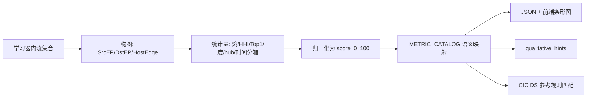
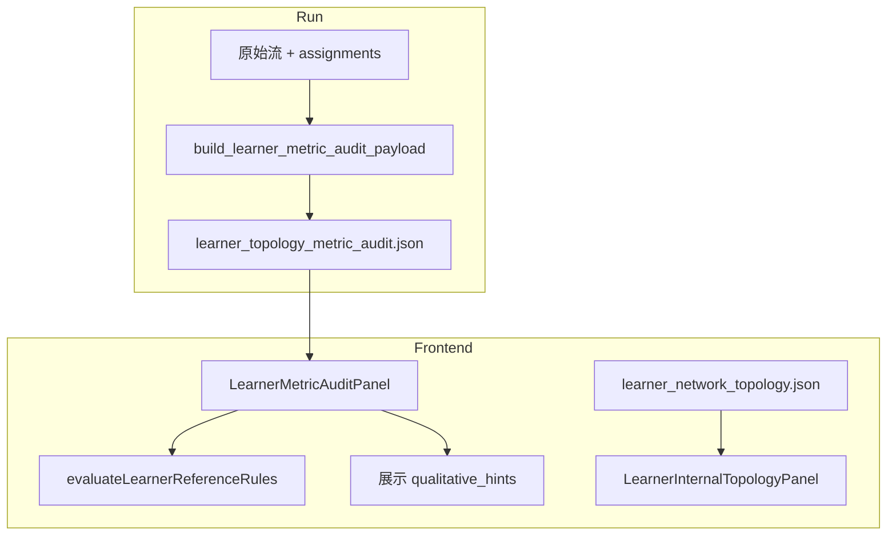

# 学习器定性方案

## 1. 背景与目标

在 Trident 流式聚类框架中，每个**学习器**承载一批被分配到的网络流。通过 `visualize` 学习器详情页观测**学习器内部拓扑图**（IP 层与 IP:Port 层）可以发现：承载正常流量的学习器与承载恶意/攻击流量的学习器，其内部图结构存在**系统性差异**——并非单点异常，而是端口分布、边复用、星型 hub、时间突发、流内单向性等多维形态的不同组合。

基于这一观测，项目设计了**规则层学习器定性**能力，目标为：

1. **建立可解释的拓扑/行为指标**，量化每个学习器内部的结构特征；
2. **用规则匹配给出语义化形态标签**，辅助人工判断学习器类别（正常型、Flood 型、扫描型、固定服务冲击型等）；
3. **输出结构化语义特征**（指标分数、特征短语、完整解释、参考 CICIDS 标签族），为后续接入大模型（LLM）做学习器级研判提供统一输入，而非直接替代人工或模型决策。

**核心约束**（贯穿设计与实现）：

- **不生成组合总分或综合风险分**；每个指标独立表示该维度上的「表现强度」（0–100），高分不等于「更恶意」。
- 规则与提示均为**参考性、可叠加**；同一学习器可同时命中多条规则。
- 禁止将 `HIGH` / `VERY_HIGH` 档位直接等同于异常结论。

---

## 2. 设计原则

| 原则 | 说明 |
|------|------|
| 证据链可读 | 人工按「边分散/集中 → 端点 hub → 端口熵 → 单向性 → 时间」顺序核对，而非看一个总分 |
| 指标去冗余 | v4 核心集 22 项；与 Top1、熵、hub 强度单调相关的指标已剔除（见 `trident_stream/metric_audit_catalog.py` 中 `REMOVED_METRICS`） |
| 语义中性 | `score_0_100` 表示特征强度；`semantic_tag` / `semantic_text` 说明「高分/低分各意味着什么」 |
| 规则可溯源 | CICIDS 参考规则阈值来自对 `2017\|` / `2019\|` 真实标签的类级指标画像统计（`docs/cicids_learner_metric_reference_rules.md`） |
| 产物可落盘 | 每次 run 自动生成 `learner_topology_metric_audit.json`，前端与学习器内部拓扑同屏展示 |

---

## 3. 观测依据：正常 vs 恶意学习器拓扑差异

### 3.1 可视化与类级对比

- **学习器级**：`LearnerInternalTopologyPanel` 展示单学习器内的有向 IP / IP:Port 图；恶意学习器常呈现明显星型（多源→少目的，或多目的扇出）、单边复用极低或极高、时间窗内集中爆发等。
- **数据集级**：`scripts/analyze_2017_benign_attack_topology_compare.py` 对比 CICIDS2017 全体 BENIGN 与 ATTACK 样本构图，攻击侧更易出现 `STRONG_SINK_HUB`、`VERY_LOW_RECIPROCITY` 等拓扑标志。
- **学习器分离度**：`learner_qualification/analyze_learner_internal_topology.py` 按 `attack_ratio` 将学习器分为 benign-learner / attack-learner，对各拓扑特征计算 **AUC**；AUC 越接近 1 表示该特征越能区分两类学习器（脚本输出 `*.separation.csv` 与 markdown 报告）。

### 3.2 CICIDS 类级指标画像（规则标定数据来源）

在 `data/aligned_2017_2019_2026_sampled_x5_yeartagged_for_main.csv` 上，将每个真实 `Label`（`2017\|…` / `2019\|…`）视为「类学习器」，用与线上一致的 audit 指标计算画像，得到稳定形态族：

| 形态族 | 典型指标特征 | 代表标签 |
|--------|----------------|----------|
| 正常参考 | 边熵高、Top1 边极低、目的端口非全局扫散、流内单向性中等 | `2017\|BENIGN`, `2019\|BENIGN` |
| 2017 固定目的服务冲击 | 目的端口熵≈0、Top1 端口≈100、目的 endpoint/入向 hub 极强；边熵可仍很高（多变化源） | DDOS, DOS_HULK, PATATOR, BOTNET, WEB_ATTACK 等 |
| 2017 端口扫描 | 目的端口熵极高、目的 endpoint 分散、Top1 端口极低 | PORTSCAN, INFILTRATION_-_PORTSCAN |
| 2019 高分散单向冲击 | 目的/源端口极分散、边接近一次性、流内极强单向 | DRDOS_*, SYN, TFTP, UDP-LAG |
| 边界 | 多类 DoS/Web 在拓扑上不可精确区分 | 规则只给**候选标签族**，不做细粒度分类 |

上述画像直接驱动第 6 节 CICIDS 参考规则阈值，以及第 5 节形态提示（qualitative hints）的阈值选取。

---

## 4. 指标如何确定

### 4.1 确定流程



1. **输入**：`assigned_learner` 关联的流字段（`Src IP`, `Dst IP`, `Src Port`, `Dst Port`, 可选 `Timestamp`, `Total Fwd Packet`, `Total Bwd packets`）。
2. **构图定义**（`docs/learner_topology_metric_audit_design.md` §2）：
   - `SrcEP = SrcIP:SrcPort`, `DstEP = DstIP:DstPort`
   - `EndpointEdge = SrcEP → DstEP`, `HostEdge = SrcIP → DstIP`
3. **统计与打分**：归一化 Shannon 熵 \(H_{norm}=H/\ln K\)、HHI、Top1 占比、有向度比例、`log1p` 映射（边复用、边节点比、端口丰富度）等；详见 `trident_stream/learner_metric_audit.py`。
4. **语义层**：`trident_stream/metric_audit_catalog.py` 为每项指标定义 `trait_axis`（分散度/集中度/突发等）、`tag_low`/`tag_high`、`explain`；由 `_semantic_tag()` 按分数档位生成 `semantic_tag`。
5. **审计与裁剪**：v4 剔除与保留项单调相关的 8 类指标（如 `top5_endpoint_edge_share`、`hub_in_strength`），保证每项提供**独立视角**。

### 4.2 强度档位（各指标通用）

| score_0_100 | strength_band | 中文 |
|-------------|---------------|------|
| 0–19 | VERY_LOW | 很弱 |
| 20–39 | LOW | 较弱 |
| 40–59 | MID | 中等 |
| 60–79 | HIGH | 较强 |
| 80–100 | VERY_HIGH | 很强 |

### 4.3 核心指标集（22 项）与语义摘要

实现版本：`METRIC_AUDIT_VERSION = 4`（`metric_audit_catalog.py`）。

#### 端口（4）

| metric_key | 名称 | raw_value 含义 | 高分语义 | 低分语义 |
|------------|------|----------------|----------|----------|
| `dst_port_entropy` | 目的端口熵 | 已出现目的端口分布的归一化熵 | 目的端口间流量更均匀 | 少数端口占主导 |
| `dst_port_richness` | 目的端口丰富度 | 不同目的端口个数（log 归一化） | 端口种类大范围展开 | 种类少 |
| `src_port_entropy` | 源端口熵 | 源端口分布归一化熵 | 源端口分散 | 源端口模板化 |
| `dst_port_top1_concentration` | 目的端口 Top1 | 最大目的端口流占比 | 固定服务/flood | 端口分散 |

#### 边（3）

| metric_key | 名称 | 高分语义 | 低分语义 |
|------------|------|----------|----------|
| `endpoint_edge_entropy` | IP:Port 边熵 | 大量边各承载少量流（扫描常见） | 少数边反复使用（flood/模板） |
| `top1_endpoint_edge_share` | Top1 边占比 | 单条边支配流量 | 流量分散 |
| `edge_reuse_ratio` | 边复用率 | 平均每边多条流 | 边几乎一次性 |

#### 主机层（4）

| metric_key | 名称 | 说明 |
|------------|------|------|
| `host_edge_entropy` | 主机边熵 | 忽略源临时端口的 IP 层分散度 |
| `dst_host_concentration` | 目的主机集中度 | 流量是否涌向少数 DstIP |
| `host_max_in_degree_ratio` | 主机最大入度比 | 多源→同一目的主机（入向 hub） |
| `host_max_out_degree_ratio` | 主机最大出度比 | 单源→多目的（扫描/探测） |

#### 端点与方向（5）

| metric_key | 名称 | 说明 |
|------------|------|------|
| `max_in_degree_ratio` | 最大入度比 | endpoint 级入向星型 |
| `max_out_degree_ratio` | 最大出度比 | endpoint 级出向星型 |
| `src_dst_endpoint_asymmetry` | 源/目的规模不对称 | \|#SrcEP − #DstEP\| 归一化 |
| `src_endpoint_concentration` | 源端点集中度 | Top1 源 endpoint 流占比 |
| `dst_endpoint_concentration` | 目的端点集中度 | Top1 目的 endpoint 流占比 |

#### 图形态（3）

| metric_key | 名称 | 说明 |
|------------|------|------|
| `leaf_ratio` | 叶子节点比例 | 无向图上 degree≤1 节点占比；高→星型/放射 |
| `edge_per_node` | 边节点比 | 连接密度（log 封顶） |
| `low_reciprocity` | 低互惠性 | **流内** `min(FwdPkt,BwdPkt)/(Fwd+Bwd)` 的补数；高→单向扫描/flood |

> **实现要点**：CIC 导出行多为单向流记录，若用反向 HostEdge 计数会导致 benign 也接近 100% 单向；故 `low_reciprocity` 必须用 Fwd/Bwd 包字段。缺字段时该指标不输出，不能解释为「强单向」。

#### 时间行为（3，需 Timestamp）

| metric_key | 名称 | 说明 |
|------------|------|------|
| `temporal_burst` | 时间突发 | 局部 100 bin HHI + 全局 span 短窗 → 高分=短 campaign |
| `temporal_global_spread` | 全局时间分散度 | run 全局 ~1h/bin，仅在 learner 足迹内有流量的 bin 上算熵 |
| `temporal_intra_uniformity` | 活跃窗内均匀度 | learner 局部 [t_min,t_max] 100 bin；持续 flood 可高分 |

### 4.4 形态解读矩阵（高分≈右侧，非「异常」）

| 形态 | 端口 | 边 | 端点/方向 | 时间 | 单向性 |
|------|------|-----|-----------|------|--------|
| 扫描 | 目的端口分散 | 边分散、低复用 | 出向星型、源可集中 | 可突发 | 高 |
| Flood | 目的端口可集中 | 单边主导、高复用 | 目的端集中 | 突发强 | 高 |
| Benign | 不定 | 边较散、低 Top1 | 较均衡 | 跨度大/较均匀 | 低 |

### 4.5 每项指标输出字段（供人工与 LLM）

```json
{
  "group": "边",
  "metric_key": "top1_endpoint_edge_share",
  "metric_name": "Top1 边占比",
  "raw_value": 0.96,
  "score_0_100": 96.0,
  "trait_axis": "concentration",
  "trait_axis_label": "集中度",
  "strength_band": "VERY_HIGH",
  "strength_label": "很强",
  "semantic_tag": "单条边主导流量",
  "semantic_text": "分数高=一条 SrcEP→DstEP 承担大部分流；低=流量分散在多条边。"
}
```

---

## 5. 形态提示（qualitative_hints）：规则如何给学习器「粗定性」

由 `compute_qualitative_hints()`（`trident_stream/learner_metric_audit.py`）在指标计算后执行，**纯阈值 AND/OR**，无机器学习、无加权总分。命中多条提示时全部列出。

### 5.1 匹配逻辑

对每条提示，读取对应 `metric_key` 的 `score_0_100`（缺失视为 0），与固定阈值比较。

### 5.2 四条形态提示规则

| hint_key | 触发条件（score_0_100） | 语义 |
|----------|-------------------------|------|
| **Flood-like** | (`top1_endpoint_edge_share` ≥ 80 **或** `dst_endpoint_concentration` ≥ 80) **且** `temporal_burst` ≥ 50 | 少数目的/边承载大量流量，伴随时间突发 |
| **Scan-like** | `dst_port_entropy` ≥ 80 **且** `max_out_degree_ratio` ≥ 50 **且** `low_reciprocity` ≥ 70 **且** `edge_reuse_ratio` ≤ 55 | 目的端口分散、出向星型、流内单向、边低复用 |
| **Single-service-like** | `dst_port_top1_concentration` ≥ 80 **且** (`top1_endpoint_edge_share` ≥ 60 **或** `endpoint_edge_entropy` ≤ 35) | 固定服务端口 + 少数边，偏服务打击或固定访问 |
| **Benign-like** | `endpoint_edge_entropy` ≥ 60 **且** `top1_endpoint_edge_share` ≤ 30 **且** `low_reciprocity` ≤ 60 **且** `temporal_burst` ≤ 50 **且** `temporal_global_spread` ≥ 35 | 边分散、无单边支配、突发弱、全局时间较分散 |

### 5.3 与 CICIDS 参考规则的关系

- **qualitative_hints**：跨数据集的**粗粒度形态**（Flood/Scan/Benign 等），写入 JSON，前端以信息条展示。
- **CICIDS 参考规则**（下一节）：在粗形态之上，对齐 **2017/2019 已知攻击族** 的细粒度参考标签，仅在前端规则层匹配，不写回 JSON。

---

## 6. CICIDS 参考规则层：规则匹配怎么做

### 6.1 定位

- 实现：`visualize/src/lib/learnerReferenceRules.ts` → `evaluateLearnerReferenceRules(metrics)`
- 文档：`docs/cicids_learner_metric_reference_rules.md`
- 展示：`LearnerMetricAuditPanel` 中「规则层匹配结果」区块

规则表达：**当前学习器的指标形态，与本地 CICIDS2017/2019 中哪类流量的类级指标画像相近**。输出包括：

- `name`：中文形态名（如「固定目的服务冲击形态」）
- `semantic`：规则语义说明
- `referenceLabels`：候选 CICIDS 标签列表（如 `2017|DDOS`, `2017|DOS_HULK`, …）
- `tone`：`benign` | `attack` | `caution`（仅 UI 配色，非结论）

**明确不输出**：预测攻击类别、最终结论、综合风险分。

### 6.2 匹配算法

```text
1. 将 metrics[] 转为 scores: Record<metric_key, score_0_100>
2. 遍历 REFERENCE_RULES 常量数组（固定顺序）
3. 对每条规则执行 rule.match(scores) → boolean
4. 为 true 的规则收集 { key, name, dataset, tone, semantic, referenceLabels }
5. 全部命中规则返回（可多选）
```

辅助谓词：`atLeast` / `atMost` / `between`；复合形态如 `isFixedTarget2017` = 核心端口/边条件 **且** 至少一项主机汇聚证据。

### 6.3 参考规则清单与阈值

#### 6.3.1 自然分散流量形态（benign）

```text
endpoint_edge_entropy >= 82
top1_endpoint_edge_share <= 8
edge_reuse_ratio between 35 and 65
dst_port_entropy <= 45
dst_port_richness <= 75
dst_port_top1_concentration between 20 and 85
low_reciprocity <= 70
max_out_degree_ratio <= 15
```

参考标签：`2017|BENIGN`, `2019|BENIGN`

#### 6.3.2 固定目的服务冲击形态（2017 攻击族）

**核心**（须全部满足）：

```text
dst_port_entropy <= 12
dst_port_richness <= 30
dst_port_top1_concentration >= 95
endpoint_edge_entropy >= 80
src_port_entropy >= 80
```

**汇聚支撑**（至少一项）：

```text
dst_host_concentration >= 65
或 max_in_degree_ratio >= 75
或 host_max_in_degree_ratio >= 75
```

参考标签：DDOS, DOS_HULK, DOS_GOLDENEYE, FTP/SSH-PATATOR, BOTNET, WEB_ATTACK_* 等

#### 6.3.3 固定目的慢速冲击形态

在 6.3.2 基础上增加：`low_reciprocity >= 68`  
参考：DOS_SLOWHTTPTEST, DOS_SLOWLORIS

#### 6.3.4 端口扫描形态

```text
dst_port_entropy >= 90
dst_port_richness >= 70
dst_port_top1_concentration <= 15
dst_endpoint_concentration <= 15
endpoint_edge_entropy >= 90
low_reciprocity <= 75
```

参考：PORTSCAN, INFILTRATION_-_PORTSCAN

#### 6.3.5 固定单边小样本形态（caution）

```text
endpoint_edge_entropy <= 20
top1_endpoint_edge_share >= 80
dst_port_top1_concentration >= 95
src_port_entropy <= 25
```

参考：HEARTBLEED（仅人工复核提示）

#### 6.3.6 高分散单向冲击形态（2019 攻击族）

```text
dst_port_entropy >= 90
dst_port_richness >= 90
dst_port_top1_concentration <= 10
endpoint_edge_entropy >= 95
edge_reuse_ratio <= 25
low_reciprocity >= 85
```

参考：DRDOS_*, SYN, TFTP, UDP-LAG 等

**源端口子形态**（在 6.3.6 命中前提下叠加，缩小候选）：

| 条件 | 候选标签 |
|------|----------|
| `src_port_entropy` 65–85 | DRDOS_DNS/LDAP/MSSQL/NETBIOS/NTP |
| `src_port_entropy` 85–98 | DRDOS_SNMP/SSDP, TFTP |
| `src_port_entropy` >= 98 | DRDOS_UDP, SYN, UDP-LAG |

#### 6.3.7 双向 Hub 服务冲击形态（caution）

```text
dst_port_entropy between 35 and 65
dst_port_top1_concentration between 50 and 85
max_in_degree_ratio >= 80
max_out_degree_ratio >= 80
endpoint_edge_entropy >= 90
```

参考：`2019|WEBDDOS`

### 6.4 人工阅读顺序（推荐）

```text
1. 规则层匹配结果 → 了解「像哪类已知流量」
2. qualitative_hints → 粗形态（Flood/Scan/Benign…）
3. 指标条形图 → 核对证据链（分散 vs Top1 vs 复用 → hub → 端口 → 单向 → 时间）
4. 学习器 dominant_label / attack_ratio → 与流标签交叉验证（非规则输入）
```

---

## 7. 数据流与产物



| 模块/文件 | 作用 |
|-----------|------|
| `trident_stream/learner_metric_audit.py` | 指标 + qualitative_hints 计算 |
| `trident_stream/metric_audit_catalog.py` | 指标语义目录 v4 |
| `trident_stream/visualization_artifacts.py` | run 结束写出 JSON |
| `learner_qualification/export_visualization_artifacts.py` | 旧 run 统一补导出（含 metric audit） |
| `outputs/runs/<run_id>/learner_topology_metric_audit.json` | 落盘产物 |
| `visualize/.../LearnerMetricAuditPanel.tsx` | 指标图 + 规则层 UI |

导出过滤（可配置）：默认 `min_samples=50`，`max_learners=60`（`visualization.metric_audit_*`）。

---

## 8. 定性效果评估

### 8.1 评估维度说明

学习器定性**不是**单一分类器的准确率问题，而应从以下维度衡量：

1. **可分性**：拓扑指标能否区分 attack-learner 与 benign-learner（AUC）；
2. **类级召回**：将每个 CICIDS 标签当作类学习器时，参考规则是否覆盖预期形态族（标签级）；
3. **误报控制**：benign 参考规则是否误命中攻击类；
4. **可用性**：语义字段是否足以支撑人工与大模型做证据链推理。

以下数值来自项目内 **`data/aligned_2017_2019_2026_sampled_x5_yeartagged_for_main.csv`** 的复现评估（每个 `Label` 为一组流，n≥50，指标计算含 Fwd/Bwd 包字段；与生产 audit 一致）。

### 8.2 CICIDS 标签级规则覆盖（参考规则）

| 规则 | 命中标签数 | 其中 BENIGN | 其中攻击 | 说明 |
|------|------------|-------------|----------|------|
| 自然分散流量形态 | 2 | 2 | 0 | 2017/2019 BENIGN 均命中；攻击零误命中 |
| 固定目的服务冲击形态 | 16 | 0 | 16 | 覆盖 DDOS, DOS_HULK/GOLDENEYE, SLOW*, PATATOR, BOTNET, WEB_ATTACK 等 2017 族 |
| 端口扫描形态 | 13 | 0 | 13 | PORTSCAN, INFILTRATION_-_PORTSCAN 等 |
| 高分散单向冲击形态 | 11 | 0 | 11 | 2019 DRDOS_*, SYN, TFTP, UDP-LAG；**SYN 的 low_reciprocity≈90.7 临界通过** |
| 固定目的慢速冲击 | 0 | — | — | 在当前采样口径下未单独命中（慢速 DoS 多落入固定目的服务规则） |
| 双向 Hub（WEBDDOS） | 0 | — | — | `2019|WEBDDOS` 样本仅 439 条，且指标未达阈值（低互惠≈60，边复用≈20） |

**结论（标签级）**：

- **正常参考规则**：对 BENIGN 召回完整（2/2），对攻击类零 FP，适合作为「形态像正常」的强约束参考。
- **2017 攻击族**：固定目的服务 + 端口扫描规则可覆盖绝大多数 2017 攻击标签；与文档 §2.2「多类 DoS 拓扑相似」一致。
- **2019 攻击族**：高分散单向规则对 DRDoS/UDP/SYN 等族召回良好；WEBDDOS 需单独规则且对样本量敏感。
- **不能精确区分的边界**（文档已声明）：2017 多种 DoS/PATATOR/Web、2019 多种 DRDOS_* 之间**不应**靠拓扑规则强行细分；规则输出候选列表供人工或 LLM 二次研判。

### 8.3 qualitative_hints 在标签级的表现

在同一评估中（含时间戳与 Fwd/Bwd 字段）：

| hint | BENIGN 命中 | 攻击命中 | 备注 |
|------|-------------|----------|------|
| Flood-like | 0 | 0 | 类级时间跨度大，`temporal_burst` 往往偏低 |
| Scan-like | 0 | 0 | 类级聚合后 `max_out_degree_ratio` 常被多源稀释 |
| Single-service-like | 0 | 0 | — |
| Benign-like | 2 | 28 | **过宽**：攻击类常满足「边熵高、Top1 低、突发不高」；仅适合作弱提示，不能作 benign 判定 |

**结论**：`qualitative_hints` 面向**真实 Trident 学习器**（聚类后的子集流）更有效；在**整类标签全集**上 Benign-like 会过命中，符合其设计定位——「辅助扫读」而非分类器。运维时应优先看 **CICIDS 参考规则 + 指标证据**，hints 作补充。

### 8.4 行为启发式规则（历史 run 审计）

`learner_qualification/analyze_learner_behavior_metrics.py` 在 `learner_label_distribution.csv` 上，以 `attack_ratio≥0.5` 为 attack、`attack_ratio<0.1` 为 benign 审计集，评估端口/时间启发式：

- `temporal_burst_score>=0.5`
- `port_scan_like` / `port_single_port` / 组合规则

输出 precision/recall 及 FP/FN 学习器名单（`learner_behavior_metrics_report.md`）。与 v4 拓扑 audit **并行**，用于验证时间/端口维度对审计标签的相关性（Spearman vs `attack_ratio`）。

### 8.5 学习器级拓扑特征 AUC

对具体 run，执行：

```bash
python3 learner_qualification/analyze_learner_internal_topology.py \
  --run-dir outputs/runs/<run_id> \
  --source-csv <aligned_or_raw_csv> \
  --attack-ratio-threshold 0.15
```

得到各特征 `auc_attack_vs_benign`。经验上 `hub_in_ratio`、`hub_out_ratio`、`weighted_reciprocity` 等往往优于 0.5；若多数特征 AUC≈0.5，说明该 run 下**仅靠簇内拓扑不足以区分**，需结合 `attack_ratio`、dominant_label 与规则层。

### 8.6 效果小结

| 能力 | 效果 | 局限 |
|------|------|------|
| 指标 + 语义 | 稳定输出 22 维可解释特征，支持人工/LLM | 不输出风险总分；高分需读 semantic |
| CICIDS 参考规则 | BENIGN 高精确；2017/2019 主攻击族高召回 | 细分类不可行；WEBDDOS/小样本弱 |
| qualitative_hints | 在学习器级可快速标 Flood/Scan 倾向 | 标签全集上 Benign-like 过宽 |
| 与拓扑图联动 | 指标与图形态互证 | 依赖 min_samples、assignment 质量 |

---

## 9. 为大模型接入预留的结构

推荐将以下内容作为 LLM 输入（无需改规则层即可对接）：

```json
{
  "learner_name": "learner_17",
  "flow_count": 12345,
  "attack_ratio": 0.92,
  "dominant_label": "DDoS",
  "metrics": [ "…每项含 metric_key, score_0_100, semantic_tag, semantic_text …" ],
  "qualitative_hints": [ "…" ],
  "reference_rule_matches": [
    {
      "name": "固定目的服务冲击形态",
      "semantic": "…",
      "referenceLabels": ["2017|DDOS", "…"]
    }
  ],
  "topology_summary": "可选：节点数、边数、可视化 URL"
}
```

Prompt 设计建议：

- 明确要求模型**引用 metric_key 与分数**作为证据；
- 声明规则为**参考**而非真值；
- 对多规则命中要求列出**主要矛盾**（如边熵高 + 目的端口 Top1 高 → 2017 固定目的多源展开）；
- 输出结构化：`morphology_guess`、`confidence`、`evidence[]`、`open_questions[]`。

---

## 10. 已知限制与后续工作

1. **阈值静态**：规则阈值来自 CICIDS 类级统计，对全新攻击或域偏移需重标定。
2. **assignment 依赖**：指标仅反映「被分到该学习器的流」；分错簇则定性偏离。
3. **导出截断**：默认最多 60 个学习器、最少 50 条流；小学习器仅有 `learners_skipped` 记录。
4. **时间/包字段**：无 `Timestamp` 则跳过时间指标；无 Fwd/Bwd 则跳过 `low_reciprocity`，2019 单向规则失效。
5. **LLM 集成**：当前仅 JSON + 前端规则；需在 API 层组装第 9 节结构并做评测集。

---

## 11. 相关文档与代码索引

| 资源 | 路径 |
|------|------|
| 指标审计设计（详细公式） | `docs/learner_topology_metric_audit_design.md` |
| CICIDS 参考规则说明 | `docs/cicids_learner_metric_reference_rules.md` |
| 指标实现 | `trident_stream/learner_metric_audit.py` |
| 语义目录 | `trident_stream/metric_audit_catalog.py` |
| 前端规则 | `visualize/src/lib/learnerReferenceRules.ts` |
| 审计面板 | `visualize/src/components/LearnerMetricAuditPanel.tsx` |
| 可视化产物说明 | `learner_qualification/ARTIFACT_PIPELINE.md` |
| 入口与命令 | `learner_qualification/README.md` |

---

*文档版本：与代码 METRIC_AUDIT_VERSION=4 及 CICIDS 参考规则前端实现同步（2026-05）。*
