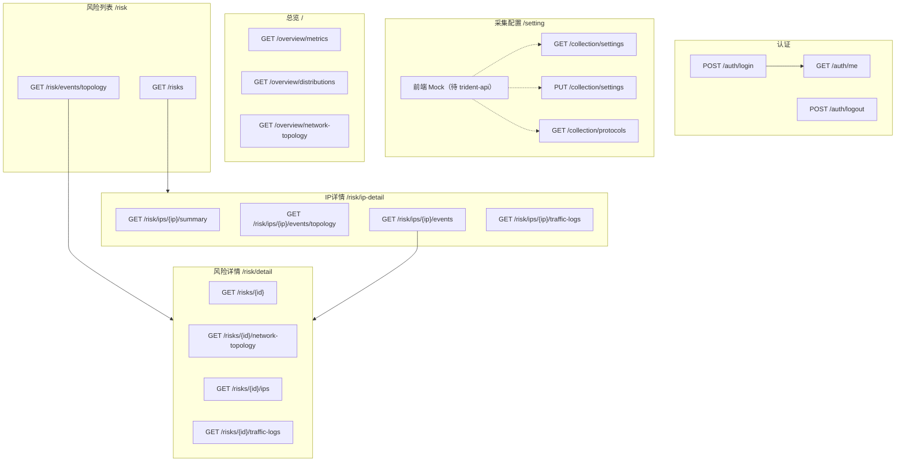

# V3-ui-2 后端接口规范

> 本文档根据前端当前页面与 Mock 数据结构整理，供后端按此实现接口。  
> 文档版本：2026-05-27（采集配置改前端 Mock，归属 streamtrident trident-api）  
> 项目路径：`V3-ui-2/`

---

## 目录

1. [全局约定](#1-全局约定)
2. [页面与接口对照](#2-页面与接口对照)
3. [已实现接口](#3-已实现接口)
4. [待实现接口](#4-待实现接口)
5. [公共数据结构](#5-公共数据结构)
6. [实现状态汇总](#6-实现状态汇总)

---

## 1. 全局约定

### 1.1 Base URL 与代理

开发环境通过 Vite 将 `/api` 前缀去掉后转发到不同后端（见 `vite.config.ts`）：

| 前端请求前缀 | 开发代理目标 | 服务 | 说明 |
|-------------|-------------|------|------|
| `/api/auth/*` | `http://127.0.0.1:9080` | backend-service | 登录、当前用户、登出 |
| `/api/*`（其余） | `http://127.0.0.1:8090`（可改为联调机地址，如 `http://172.16.2.110:18090`） | streamtrident **trident-api** | 总览、风险；**采集配置接口规范亦归属此服务** |
| 生产 | 由 `VITE_API_BASE_URL` 配置 | — | 由部署/nginx 统一转发 |

示例：

- `GET /api/auth/me` → `GET http://127.0.0.1:9080/auth/me`
- `GET /api/overview/metrics` → `GET http://127.0.0.1:8090/overview/metrics`
- `GET /api/collection/settings`（对接后）→ `GET http://127.0.0.1:8090/collection/settings`

> **采集配置**：当前前端 **不发起 HTTP**，使用内存 Mock（`src/mock/collectionSettings.ts`）。取消 Mock 后，上述 `/collection/*` 路径与总览、风险共用 `/api` → trident-api 代理即可。

### 1.2 统一响应格式

所有 JSON 接口建议使用如下包装（前端 `request.ts` 已按此解析）：

```json
{
  "code": 200,
  "message": "success",
  "data": { }
}
```

| 字段 | 类型 | 说明 |
|------|------|------|
| `code` | number | `200` 或 `201` 视为成功，其余前端会弹错并 reject |
| `message` | string | 可选，错误时展示给用户 |
| `data` | T | 业务数据，类型见各接口说明 |

### 1.3 认证

- 除登录外，请求头需携带：`Authorization: Bearer <token>`
- Token 由 `POST /auth/login` 返回，前端存入 `localStorage.token`
- `401` 时前端会清除 token 并跳转 `/login`

### 1.4 分页约定

风险列表等分页接口建议统一使用 **offset 分页**（与前端 Mock 对齐）：

| 参数 | 类型 | 说明 |
|------|------|------|
| `limit` | number | 每页条数，前端固定 `10` |
| `offset` | number | 偏移量，`(page - 1) * limit` |

响应中需包含 `total`（总条数）。

### 1.5 时间格式

- 展示用时间字符串：`YYYY-MM-DD HH:mm:ss`（如 `2026-05-25 09:12:33`）
- 查询参数中的时段：`triggerStart`、`triggerEnd`，建议同样格式或 ISO8601，需与前端 RangePicker 输出一致

### 1.6 时间范围筛选（总览）

总览页指标区支持 `timeRange` 查询参数：

| 值 | 含义 |
|----|------|
| `24h` | 近 24 小时（默认） |
| `7d` | 近 7 天 |
| `30d` | 近一个月 |

---

## 2. 页面与接口对照

| 路由 | 页面 | 需调用的接口 | 当前状态 |
|------|------|-------------|----------|
| `/login` | 登录 | `POST /auth/login` | ✅ 已对接 |
| `/` | 总览 | 见 [4.1 总览模块](#41-总览模块) | ❌ Mock |
| `/risk` | 风险列表（事件/IP 视角） | 见 [4.2 风险模块](#42-风险模块) | ❌ Mock |
| `/risk/detail?id=` | 风险事件详情 | 见 [4.2.3](#423-风险事件详情页) | ❌ Mock |
| `/risk/ip-detail?ip=` | IP 详情 | 见 [4.2.4](#424-ip-详情页) | ❌ Mock |
| `/setting` | 采集配置 | `GET/PUT /collection/settings`、`GET /collection/protocols` | 🟡 前端 Mock（待 trident-api 实现） |
| `/posture` 等 | 占位页 | 无 | — |

---

## 3. 已实现接口

当前仅 **认证** 模块已对接 backend-service；采集配置、总览、风险见 [第 4 节](#4-待实现接口)。

### 3.1 认证

#### POST `/auth/login`

**请求体：**

```json
{
  "username": "string",
  "password": "string"
}
```

**响应 `data`：**

```json
{
  "token": "string",
  "user": {
    "id": 1,
    "username": "string",
    "email": "string",
    "nickname": "string"
  }
}
```

| 字段 | 类型 | 必填 | 说明 |
|------|------|------|------|
| `token` | string | 是 | JWT 或会话 token |
| `user.id` | number | 是 | 用户 ID |
| `user.username` | string | 是 | 用户名 |
| `user.email` | string | 否 | 邮箱 |
| `user.nickname` | string | 否 | 昵称，顶栏展示优先使用 |

---

#### GET `/auth/me`

**响应 `data`：**

```json
{
  "user": {
    "id": 1,
    "username": "string",
    "email": "string | null",
    "nickname": "string | null"
  }
}
```

---

#### POST `/auth/logout`

**响应 `data`：** `null`

> 失败时前端仍会清除本地 token 并跳转登录页。

---

## 4. 待实现接口

以下接口路径为**建议命名**，可与现有后端路由对齐，但 **`data` 字段结构需保持一致**。  
除特别说明外，由 **streamtrident trident-api**（`streamtrident_services/trident`，compose 默认端口 `8090`）实现。

---

### 4.1 总览模块

**页面：** `/`（`HomeView.tsx`）

#### GET `/overview/metrics`

核心指标卡片（4 项）。

**Query：**

| 参数 | 类型 | 必填 | 说明 |
|------|------|------|------|
| `timeRange` | string | 否 | `24h` \| `7d` \| `30d`，默认 `24h` |

**响应 `data`：**

```json
{
  "totalTraffic": 34,
  "protocolCount": 1244,
  "riskTypeCount": 34,
  "suspiciousIpCount": 1244
}
```

| 字段 | 类型 | 前端展示 |
|------|------|----------|
| `totalTraffic` | number | 总流量 |
| `protocolCount` | number | 协议数 |
| `riskTypeCount` | number | 风险类型数 |
| `suspiciousIpCount` | number | 风险 IP 数 |

---

#### GET `/overview/distributions`

流量分布 + 协议分布（环形图）。

**Query：** `timeRange`（同上）

**响应 `data`：**

```json
{
  "traffic": [
    { "name": "正常流量", "value": 7234, "color": "#52c41a" },
    { "name": "异常流量", "value": 2812, "color": "#ff7875" }
  ],
  "protocol": [
    { "name": "HTTP", "value": 3520, "color": "#4368f0" },
    { "name": "HTTPS", "value": 2840, "color": "#1777ff" }
  ]
}
```

**`DistributionItem`：**

| 字段 | 类型 | 必填 | 说明 |
|------|------|------|------|
| `name` | string | 是 | 分类名称 |
| `value` | number | 是 | 数量/权重 |
| `color` | string | 否 | 图表颜色（hex），不传则前端自动配色 |

---

#### GET `/overview/network-topology`

总览页网络拓扑（部分异常 / 良性 / 异常 三视图）。

**Query：** `timeRange`（同上）

**响应 `data`：** 见 [5.2 DatasetNetworkTopologyJson](#52-datasetnetworktopologyjson总览风险单事件拓扑)

**视图要求：**

- `views` 中需包含三个 key：`__combined__`（总拓扑）、`__benign__`（正常流量）、`__attack__`（异常流量）
- 每个视图含 `host`（IP 主机图）与 `endpoint`（IP:端口 服务图）

---

### 4.2 风险模块

#### 4.2.1 风险事件实体 `RiskItem`

多个接口共用的基础结构：

```json
{
  "id": 1,
  "subjectIp": "10.12.45.88",
  "name": "异常外联至境外 C2",
  "triggerTime": "2026-05-25 09:12:33",
  "description": "内网主机持续向境外可疑 IP 发起 HTTPS 长连接...",
  "features": "高频外联、TLS 指纹异常、非业务时段活跃"
}
```

| 字段 | 类型 | 必填 | 说明 |
|------|------|------|------|
| `id` | number | 是 | 风险事件 ID |
| `subjectIp` | string | 是 | 风险主体 IP |
| `name` | string | 是 | 风险名称 |
| `triggerTime` | string | 是 | 触发时间，`YYYY-MM-DD HH:mm:ss` |
| `description` | string | 是 | 风险说明 |
| `features` | string | 是 | 风险特征，中文顿号 `、` 分隔，前端会拆成 Tag 展示 |

---

#### 4.2.2 风险列表页 `/risk`

##### Tab：IP 视角（表格）

#### GET `/risks`

分页风险列表（**按 IP 维度聚合**，一行一个 IP；同一 IP 下按风险名称统计触发次数）。

**Query：**

| 参数 | 类型 | 必填 | 说明 |
|------|------|------|------|
| `limit` | number | 是 | 每页条数，前端传 `10` |
| `offset` | number | 是 | 偏移量 |
| `name` | string | 否 | 风险名称，模糊匹配（命中该 IP 下任一风险名称即保留该行） |
| `subjectIp` | string | 否 | 风险主体 IP，模糊匹配 |

**响应 `data`：**

```json
{
  "total": 12,
  "risks": [
    {
      "id": 1,
      "subjectIp": "10.12.45.88",
      "riskCount": 2,
      "risks": [
        { "name": "异常外联至境外 C2", "triggerCount": 3 },
        { "name": "DNS 隧道数据传输", "triggerCount": 2 }
      ]
    }
  ]
}
```

| 字段 | 类型 | 说明 |
|------|------|------|
| `id` | number | 列表行 ID（按 IP 维度） |
| `subjectIp` | string | 风险主体 IP |
| `riskCount` | number | 该 IP 关联的不同风险种类数 |
| `risks` | array | 该 IP 关联的风险名称及触发次数 |
| `risks[].name` | string | 风险名称 |
| `risks[].triggerCount` | number | 该风险在该 IP 上的触发次数 |

**表格列：** `subjectIp`、`riskCount`、`risks`（展示为多个 Tag：`{name}（{triggerCount}）`）；操作跳转 `/risk/ip-detail?ip={subjectIp}`。

---

##### Tab：事件视角（学习器拓扑卡片）

#### GET `/risk/events/topology`

返回事件视角的学习器拓扑网格数据。

**Query：**

| 参数 | 类型 | 必填 | 说明 |
|------|------|------|------|
| `name` | string | 否 | 风险名称关键词，模糊匹配（匹配 name / learner / dominantLabel / riskName / riskDescription） |
| `triggerStart` | string | 否 | 触发时段开始（UI 已有筛选，Mock 未实现，**后端需支持**） |
| `triggerEnd` | string | 否 | 触发时段结束 |

**响应 `data`：** 见 [5.3 LearnerNetworkTopologyJson](#53-learnernetworktopologyjson事件视角ip详情事件卡)

**前端行为：**

- 卡片按 `attack_ratio` 降序排列
- 点击卡片「详情」→ `/risk/detail?id={risk_id}`

---

#### 4.2.3 风险事件详情页

**路由：** `/risk/detail?id={riskId}`

##### GET `/risks/{id}`

**路径参数：** `id` — 风险事件 ID

**响应 `data`：** `RiskItem`

**顶栏额外字段（当前硬编码，需后端提供）：**

建议在 `RiskItem` 上扩展，或单独字段：

| 字段 | 类型 | 说明 |
|------|------|------|
| `riskIpCount` | number | 风险 IP 数（当前页面写死 `99`） |

---

##### GET `/risks/{id}/network-topology`

**响应 `data`：** `DatasetNetworkTopologyJson`

- 前端使用 `views.__combined__` 下的 `host` + `endpoint` 双图
- 单事件详情只需返回 `__combined__` 视图即可

---

##### GET `/risks/{id}/ips`

风险 IP 列表，按 `triggerCount` **降序**。

**响应 `data`：**

```json
[
  { "ip": "10.12.45.88", "triggerCount": 320 },
  { "ip": "10.20.6.15", "triggerCount": 298 }
]
```

| 字段 | 类型 | 说明 |
|------|------|------|
| `ip` | string | IP 地址 |
| `triggerCount` | number | 该 IP 在此风险下的触发次数 |

> 前端当前为客户端分页（`pageSize=10`）。若数据量大，可改为服务端分页并增加 `limit`/`offset`/`total`。

---

##### GET `/risks/{id}/traffic-logs`

**响应 `data`：**

```json
[
  {
    "id": "1-0",
    "time": "2026-05-25 09:12:33",
    "ip": "10.12.45.88",
    "protocol": "HTTPS"
  }
]
```

| 字段 | 类型 | 说明 |
|------|------|------|
| `id` | string | 日志唯一标识 |
| `time` | string | 时间，`YYYY-MM-DD HH:mm:ss` |
| `ip` | string | 相关 IP |
| `protocol` | string | 协议名 |

---

##### GET `/risks/{id}/protocol-distribution`（可选）

**响应 `data`：**

```json
[
  { "name": "TCP", "value": 4200 },
  { "name": "UDP", "value": 2800 }
]
```

> 当前详情页 **未展示**协议分布图，Mock 已定义。若后续产品需要可直接接入。

---

#### 4.2.4 IP 详情页

**路由：** `/risk/ip-detail?ip={ip}`

##### GET `/risk/ips/{ip}/summary`

**路径参数：** `ip` — URL 编码的 IP 地址

**响应 `data`：**

```json
{
  "ip": "10.12.45.88",
  "description": "10.12.45.88 作为风险主体共关联 26 次风险事件...",
  "features": "高频外联、TLS 指纹异常",
  "riskEventCount": 26,
  "latestTriggerTime": "2026-05-25 09:12:33",
  "isInternal": true
}
```

| 字段 | 类型 | 说明 |
|------|------|------|
| `ip` | string | IP 地址 |
| `description` | string | IP 风险摘要说明 |
| `features` | string | 风险特征，顿号分隔 |
| `riskEventCount` | number | 关联风险事件数（顶栏「风险数」） |
| `latestTriggerTime` | string | 最近触发时间 |
| `isInternal` | boolean | 是否内网 IP（`true` 显示蓝色「内网 IP」，`false` 显示橙色「外网 IP」） |

---

##### GET `/risk/ips/{ip}/events/topology`

与 IP 关联的风险事件拓扑卡片（最多展示 6 个事件）。

**响应 `data`：** `LearnerNetworkTopologyJson`

- `views` 的 key 格式：`ip_risk_{eventId}`（如 `ip_risk_1`）
- `learners` 数组与 `views` 的 key 一一对应

---

##### GET `/risk/ips/{ip}/events`

**响应 `data`：**

```json
[
  {
    "id": 1,
    "name": "异常外联至境外 C2",
    "triggerTime": "2026-05-25 09:12:33",
    "description": "...",
    "features": "高频外联、TLS 指纹异常"
  }
]
```

| 字段 | 类型 | 说明 |
|------|------|------|
| `id` | number | 风险事件 ID |
| `name` | string | 风险名称 |
| `triggerTime` | string | 触发时间 |
| `description` | string | 风险说明 |
| `features` | string | 风险特征 |

**排序：** 按 `triggerTime` **降序**（近的在前）。

**操作列规则：** 仅当 `id < 10000` 时显示「查看」按钮，跳转 `/risk/detail?id={id}`。  
（Mock 中 `id >= 10000` 为合成数据，不可跳转详情；后端若无不跳转需求可统一返回真实 ID。）

---

##### GET `/risk/ips/{ip}/traffic-logs`

结构与 [风险详情流量日志](#get-risksidtraffic-logs) 相同，`RiskTrafficLogItem[]`。  
日志中的 `ip` 可为会话对端 IP，主体 IP 以路径参数为准。

---

### 4.3 采集配置模块

**页面：** `/setting`（`SettingView.tsx`）  
**实现服务：** streamtrident **trident-api**（与总览、风险共用 `/api` 代理）  
**前端现状：** `SettingService` 仅调用 `src/mock/collectionSettings.ts`（内存读写，刷新页面重置）；**未请求后端**。

#### GET `/collection/settings`

**响应 `data`（`CollectionSettings`）：**

```json
{
  "maxTrafficLimitGbps": 10,
  "sourceIpRanges": [
    { "startIp": "10.0.0.0", "endIp": "10.255.255.255" }
  ],
  "destIpRanges": [
    { "startIp": "0.0.0.0", "endIp": "255.255.255.255" }
  ],
  "protocols": ["TCP", "UDP", "HTTPS", "HTTP", "DNS"]
}
```

| 字段 | 类型 | 必填 | 说明 |
|------|------|------|------|
| `maxTrafficLimitGbps` | number | 是 | 流量上限（Gbps），表单校验 > 0.01 |
| `sourceIpRanges` | IpRangeItem[] | 是 | 源 IP 段，至少 1 条 |
| `destIpRanges` | IpRangeItem[] | 是 | 目的 IP 段，至少 1 条 |
| `protocols` | string[] | 是 | 采集协议，值为协议选项的 `value`，至少 1 个 |

**`IpRangeItem`：**

```json
{ "startIp": "10.0.0.0", "endIp": "10.255.255.255" }
```

- `startIp`、`endIp` 均为 IPv4 字符串，必填

**Mock 默认值：** 与上表一致，见 `src/mock/collectionSettings.ts` 中 `DEFAULT_SETTINGS`。

---

#### PUT `/collection/settings`

**请求体：** 与 GET 响应 `data` 结构相同。

**响应 `data`：** 保存后的完整 `CollectionSettings`。

---

#### GET `/collection/protocols`

**响应 `data`：** 协议多选选项数组。

```json
[
  { "value": "TCP", "label": "TCP" },
  { "value": "UDP", "label": "UDP" },
  { "value": "HTTP", "label": "HTTP" },
  { "value": "HTTPS", "label": "HTTPS" },
  { "value": "DNS", "label": "DNS" },
  { "value": "SSH", "label": "SSH" },
  { "value": "SMB", "label": "SMB" },
  { "value": "RDP", "label": "RDP" },
  { "value": "ICMP", "label": "ICMP" },
  { "value": "TLS", "label": "TLS" },
  { "value": "FTP", "label": "FTP" },
  { "value": "OTHER", "label": "其他" }
]
```

| 字段 | 类型 | 说明 |
|------|------|------|
| `value` | string | 提交/存储用的协议标识 |
| `label` | string | 界面展示文案 |

**前端对接步骤（trident-api 就绪后）：**

1. 在 trident-api 实现上述三个接口，响应格式遵循 [1.2 统一响应格式](#12-统一响应格式)。
2. 将 `SettingService` 改回 `request` 调用 `/collection/settings`、`/collection/protocols`。
3. 删除或停用 `src/mock/collectionSettings.ts` 中的 Mock 调用。

---

## 5. 公共数据结构

### 5.1 拓扑图元数据

#### TopologyNode

```json
{
  "id": "10.12.45.88",
  "ip": "10.12.45.88",
  "port": null,
  "flow_count": 9020,
  "is_internal": true
}
```

| 字段 | 类型 | 说明 |
|------|------|------|
| `id` | string | 节点唯一 ID，通常与 `ip` 或 `ip:port` 一致 |
| `ip` | string | IP 地址 |
| `port` | number \| null | 端口，`host` 模式下为 `null` |
| `flow_count` | number | 该节点流量数 |
| `is_internal` | boolean | 是否内网 |

#### TopologyLink

```json
{
  "source": "10.12.45.88",
  "target": "203.0.113.17",
  "value": 3200,
  "is_benign": false
}
```

| 字段 | 类型 | 说明 |
|------|------|------|
| `source` | string | 源节点 `id` |
| `target` | string | 目标节点 `id` |
| `value` | number | 边权重/流量数 |
| `is_benign` | boolean | 可选，良性为 `true`，异常为 `false`；影响连线颜色（绿/红） |

#### TopologyGraph

```json
{
  "flow_count": 125000,
  "node_mode": "host",
  "nodes": [ /* TopologyNode[] */ ],
  "links": [ /* TopologyLink[] */ ],
  "stats": {
    "top_dst_port": 443,
    "top_dst_port_ratio": 0.42
  }
}
```

| 字段 | 类型 | 说明 |
|------|------|------|
| `flow_count` | number | 该图总流量 |
| `node_mode` | string | `"host"` 或 `"endpoint"` |
| `nodes` | TopologyNode[] | 节点列表 |
| `links` | TopologyLink[] | 边列表 |
| `stats` | Record<string, number> | 统计扩展字段，键名自定义 |

#### TopologyLabelView

```json
{
  "label": "__combined__",
  "view_kind": "aggregate",
  "is_benign": null,
  "host": { /* TopologyGraph */ },
  "endpoint": { /* TopologyGraph */ }
}
```

| 字段 | 类型 | 说明 |
|------|------|------|
| `label` | string | 视图标识 |
| `view_kind` | string | 可选，`"label"` \| `"aggregate"` |
| `is_benign` | boolean \| null | `null`=部分异常，`true`=良性，`false`=异常 |
| `host` | TopologyGraph | IP（主机）拓扑 |
| `endpoint` | TopologyGraph | IP:端口（服务）拓扑 |

---

### 5.2 DatasetNetworkTopologyJson（总览/风险单事件拓扑）

用于：总览三视图、风险详情单事件拓扑。

```json
{
  "version": 1,
  "total_flows": 125000,
  "labels": [],
  "default_label": "__combined__",
  "default_node_mode": "host",
  "aggregate_views": ["__combined__", "__benign__", "__attack__"],
  "views": {
    "__combined__": { /* TopologyLabelView */ },
    "__benign__": { /* TopologyLabelView, is_benign: true */ },
    "__attack__": { /* TopologyLabelView, is_benign: false */ }
  }
}
```

| 字段 | 类型 | 说明 |
|------|------|------|
| `version` | number | 数据结构版本，当前为 `1` |
| `total_flows` | number | 总流数 |
| `labels` | string[] | 标签列表，可为空数组 |
| `default_label` | string | 默认视图 key，通常为 `"__combined__"` |
| `default_node_mode` | string | 可选，`"endpoint"` \| `"host"` |
| `aggregate_views` | string[] | 可选，聚合视图 key 列表 |
| `views` | Record<string, TopologyLabelView> | 视图字典 |

---

### 5.3 LearnerNetworkTopologyJson（事件视角/IP详情事件卡）

用于：风险列表「事件视角」、IP 详情「关联风险事件」拓扑卡片。

```json
{
  "version": 1,
  "learners": ["learner_lstm_https", "learner_gmm_ssh"],
  "default_learner": "learner_lstm_https",
  "views": {
    "learner_lstm_https": { /* LearnerTopologyView */ }
  }
}
```

#### LearnerTopologyView

```json
{
  "learner": "learner_lstm_https",
  "risk_id": 1,
  "risk_name": "异常外联至境外 C2",
  "risk_description": "内网主机持续向境外可疑 IP...",
  "trigger_time": "2026-05-25 09:12:33",
  "attack_ratio": 0.382,
  "dominant_label": "HTTPS",
  "dominant_ratio": 0.54,
  "is_benign": null,
  "host": { /* TopologyGraph */ },
  "endpoint": { /* TopologyGraph */ }
}
```

| 字段 | 类型 | 必填 | 说明 |
|------|------|------|------|
| `learner` | string | 是 | 学习器/卡片 key |
| `risk_id` | number | 是 | 关联风险 ID，用于跳转详情 |
| `risk_name` | string | 否 | 卡片标题 |
| `risk_description` | string | 否 | 卡片描述 |
| `trigger_time` | string | 否 | 触发时间 |
| `attack_ratio` | number | 是 | 异常占比 0~1，**卡片排序依据** |
| `dominant_label` | string | 否 | 主导协议/标签 |
| `dominant_ratio` | number | 否 | 主导占比 0~1 |
| `is_benign` | boolean \| null | 否 | 良性标识 |
| `host` | TopologyGraph | 是 | 主机拓扑 |
| `endpoint` | TopologyGraph | 是 | 端口拓扑 |

**`learners` 数组：** 与 `views` 的 key 对应，建议按 `attack_ratio` 降序排列。

---

## 6. 实现状态汇总

### 6.1 接口清单

| 模块 | 方法 | 路径 | 状态 |
|------|------|------|------|
| 认证 | POST | `/auth/login` | ✅ 已实现 |
| 认证 | GET | `/auth/me` | ✅ 已实现 |
| 认证 | POST | `/auth/logout` | ✅ 已实现 |
| 采集 | GET | `/collection/settings` | 🟡 前端 Mock / trident-api 待实现 |
| 采集 | PUT | `/collection/settings` | 🟡 前端 Mock / trident-api 待实现 |
| 采集 | GET | `/collection/protocols` | 🟡 前端 Mock / trident-api 待实现 |
| 总览 | GET | `/overview/metrics` | ❌ 待实现 |
| 总览 | GET | `/overview/distributions` | ❌ 待实现 |
| 总览 | GET | `/overview/network-topology` | ❌ 待实现 |
| 风险 | GET | `/risks` | ❌ 待实现 |
| 风险 | GET | `/risk/events/topology` | ❌ 待实现 |
| 风险 | GET | `/risks/{id}` | ❌ 待实现 |
| 风险 | GET | `/risks/{id}/network-topology` | ❌ 待实现 |
| 风险 | GET | `/risks/{id}/ips` | ❌ 待实现 |
| 风险 | GET | `/risks/{id}/traffic-logs` | ❌ 待实现 |
| 风险 | GET | `/risks/{id}/protocol-distribution` | ❌ 可选 |
| 风险 | GET | `/risk/ips/{ip}/summary` | ❌ 待实现 |
| 风险 | GET | `/risk/ips/{ip}/events/topology` | ❌ 待实现 |
| 风险 | GET | `/risk/ips/{ip}/events` | ❌ 待实现 |
| 风险 | GET | `/risk/ips/{ip}/traffic-logs` | ❌ 待实现 |

### 6.2 前端源码索引

| 用途 | 文件路径 |
|------|----------|
| HTTP 封装 | `src/utils/request.ts` |
| 认证服务 | `src/api/services/AuthService.ts` |
| 采集服务（当前 Mock） | `src/api/services/SettingService.ts` |
| 采集配置类型 | `src/types/collectionSettings.ts` |
| 采集配置 Mock | `src/mock/collectionSettings.ts` |
| 风险实体类型 | `src/api/types.ts` → `RiskItem` |
| 数据集拓扑类型 | `src/components/NetworkTopologyPanel.tsx` |
| 学习器拓扑类型 | `src/types/learnerTopology.ts` |
| 风险 Mock（含子资源形状） | `src/mock/riskTasks.ts` |
| 事件/IP 拓扑 Mock | `src/mock/eventLearnerTopology.ts` |
| 总览分布 Mock | `src/mock/overviewDistribution.ts` |
| 总览拓扑 Mock | `src/mock/overviewTopology.ts` |

### 6.3 对接注意事项

1. **字段命名**：拓扑相关 JSON 使用 **snake_case**（如 `risk_id`、`attack_ratio`），与前端类型定义一致；业务实体 `RiskItem` 使用 **camelCase**。
2. **事件视角时段筛选**：UI 已提供 `triggerStart` / `triggerEnd`，Mock 未过滤，后端需实现。
3. **风险详情「风险 IP 数」**：当前写死 `99`，对接后应使用接口返回的 `riskIpCount`（或等价字段）。
4. **IP 详情合成事件**：Mock 中 `id >= 10000` 的事件不可跳转详情；若后端无此区分，可全部返回可跳转的真实 ID。
5. **错误码预留**：`request.ts` 已处理 `VLLM_NOT_READY`（503）、`TASK_ALREADY_RUNNING`（400），主要为其他模块预留，风险域暂不涉及。
6. **采集配置**：已从 backend-service（9080）剥离；规范由 trident-api 实现，开发期前端 Mock，不再经 `/api/collection` 单独代理。
7. **双后端代理**：认证走 `9080`，业务数据（含未来采集接口）走 trident-api `8090`（见 [1.1](#11-base-url-与代理)）。

---

## 附录：接口与页面对应关系图



---

*文档由 V3-ui-2 前端代码自动梳理生成。如有字段变更，请同步更新本文档与前端类型定义。*
