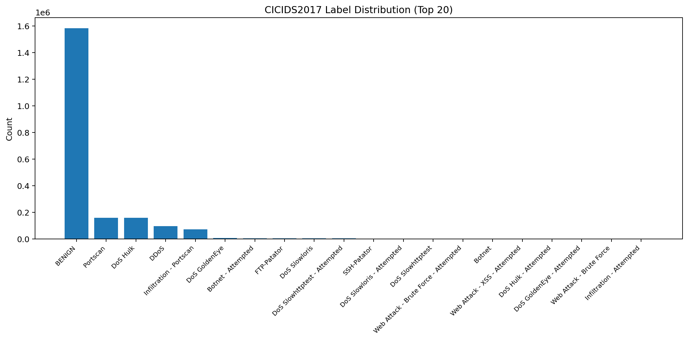
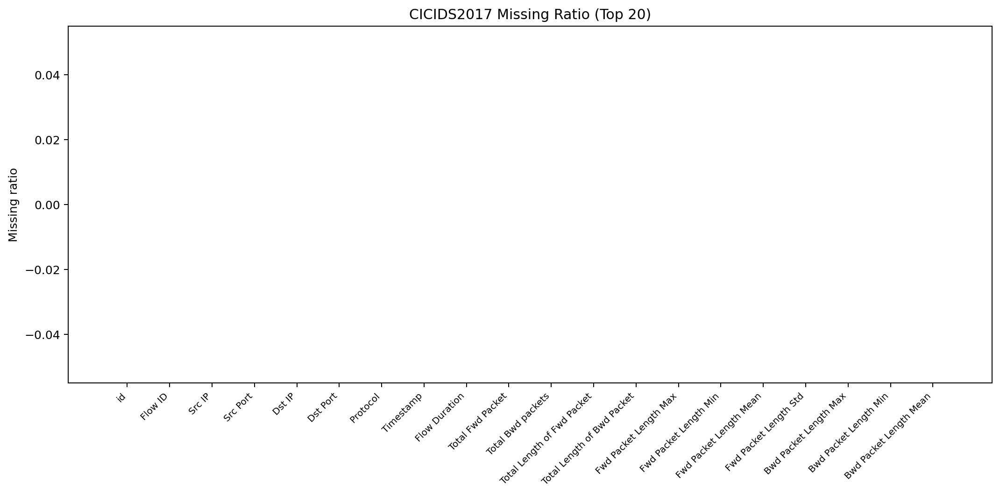
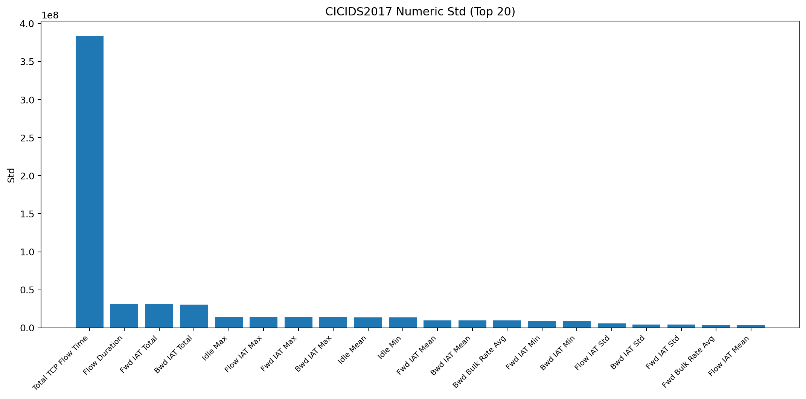
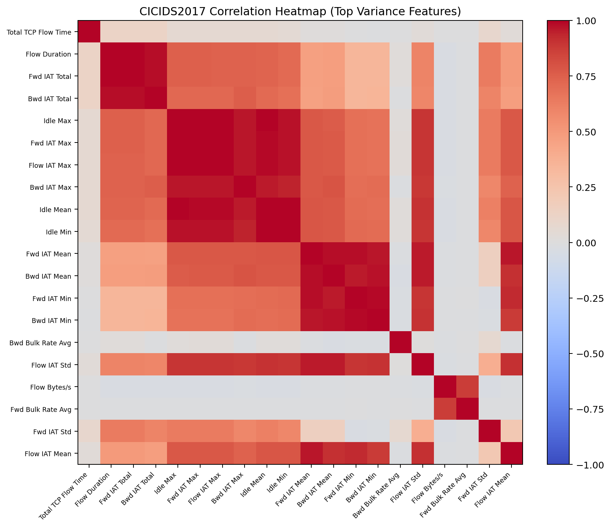
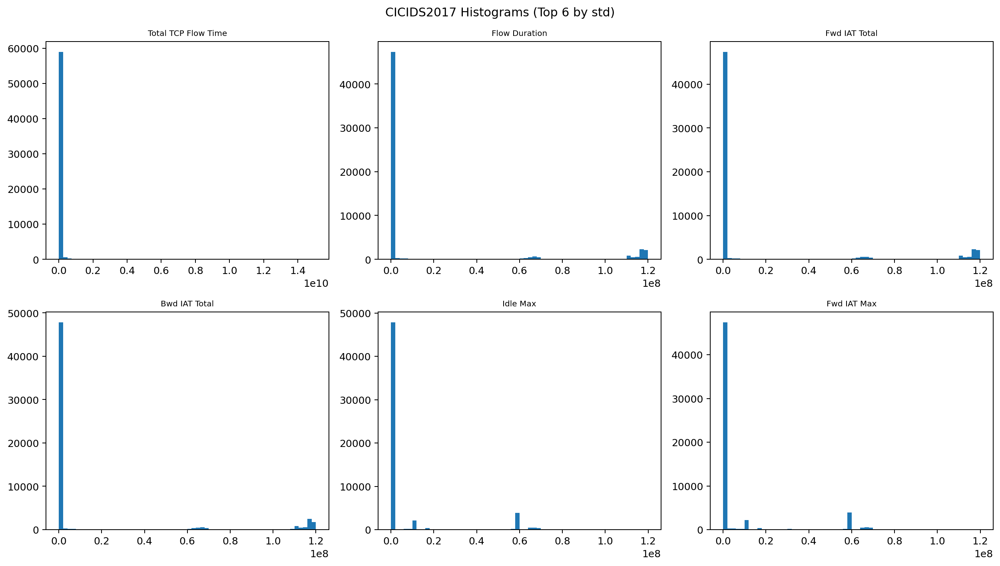
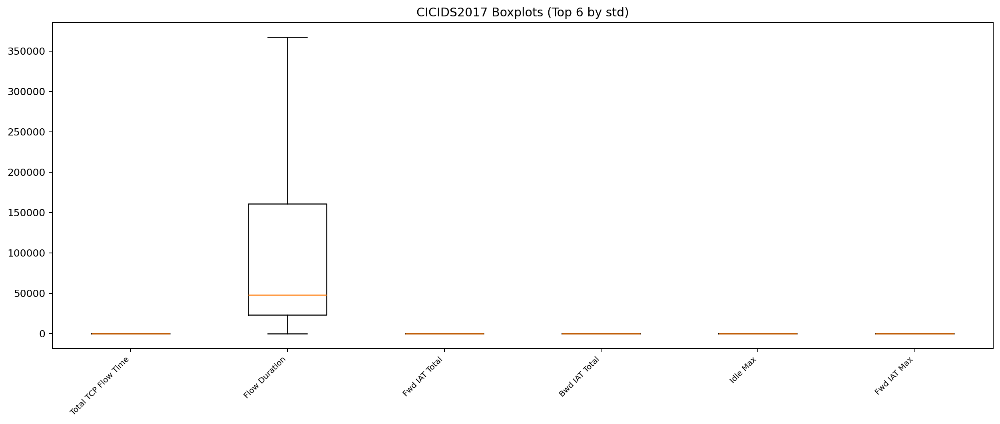

# CICIDS2017 EDA

## 数据概览

- 文件数: 5
- 总样本数: 2,099,976
- 列数: 91
- 标签列: `Label`
- 总文件大小: 1.07 GB

| 文件 | 大小(GB) |
|---|---:|
| friday.csv | 0.266 |
| monday.csv | 0.194 |
| thursday.csv | 0.177 |
| tuesday.csv | 0.166 |
| wednesday.csv | 0.271 |

## 缺失值 Top 20

| 列名 | 缺失数量 | 缺失率 |
|---|---:|---:|
| id | 0 | 0.00% |
| Flow ID | 0 | 0.00% |
| Src IP | 0 | 0.00% |
| Src Port | 0 | 0.00% |
| Dst IP | 0 | 0.00% |
| Dst Port | 0 | 0.00% |
| Protocol | 0 | 0.00% |
| Timestamp | 0 | 0.00% |
| Flow Duration | 0 | 0.00% |
| Total Fwd Packet | 0 | 0.00% |
| Total Bwd packets | 0 | 0.00% |
| Total Length of Fwd Packet | 0 | 0.00% |
| Total Length of Bwd Packet | 0 | 0.00% |
| Fwd Packet Length Max | 0 | 0.00% |
| Fwd Packet Length Min | 0 | 0.00% |
| Fwd Packet Length Mean | 0 | 0.00% |
| Fwd Packet Length Std | 0 | 0.00% |
| Bwd Packet Length Max | 0 | 0.00% |
| Bwd Packet Length Min | 0 | 0.00% |
| Bwd Packet Length Mean | 0 | 0.00% |

## 标签分布 Top 20

| 标签 | 数量 | 占比 |
|---|---:|---:|
| BENIGN | 1,582,566 | 75.36% |
| Portscan | 159,066 | 7.57% |
| DoS Hulk | 158,468 | 7.55% |
| DDoS | 95,144 | 4.53% |
| Infiltration - Portscan | 71,767 | 3.42% |
| DoS GoldenEye | 7,567 | 0.36% |
| Botnet - Attempted | 4,067 | 0.19% |
| FTP-Patator | 3,972 | 0.19% |
| DoS Slowloris | 3,859 | 0.18% |
| DoS Slowhttptest - Attempted | 3,368 | 0.16% |
| SSH-Patator | 2,961 | 0.14% |
| DoS Slowloris - Attempted | 1,847 | 0.09% |
| DoS Slowhttptest | 1,740 | 0.08% |
| Web Attack - Brute Force - Attempted | 1,292 | 0.06% |
| Botnet | 736 | 0.04% |
| Web Attack - XSS - Attempted | 655 | 0.03% |
| DoS Hulk - Attempted | 581 | 0.03% |
| DoS GoldenEye - Attempted | 80 | 0.00% |
| Web Attack - Brute Force | 73 | 0.00% |
| Infiltration - Attempted | 45 | 0.00% |

## 数值特征统计 Top 20（按标准差）

| 列名 | count | mean | std | min | max | zero_ratio |
|---|---:|---:|---:|---:|---:|---:|
| Total TCP Flow Time | 2,099,976 | 3.157e+07 | 3.841e+08 | 0 | 3.029e+10 | 47.68% |
| Flow Duration | 2,099,976 | 1.244e+07 | 3.103e+07 | 0 | 1.2e+08 | 0.00% |
| Fwd IAT Total | 2,099,976 | 1.237e+07 | 3.101e+07 | 0 | 1.2e+08 | 22.18% |
| Bwd IAT Total | 2,099,976 | 1.163e+07 | 3.069e+07 | 0 | 1.2e+08 | 24.63% |
| Idle Max | 2,099,976 | 4.678e+06 | 1.45e+07 | 0 | 1.2e+08 | 77.76% |
| Flow IAT Max | 2,099,976 | 4.922e+06 | 1.444e+07 | 0 | 1.2e+08 | 0.00% |
| Fwd IAT Max | 2,099,976 | 4.891e+06 | 1.444e+07 | 0 | 1.2e+08 | 22.18% |
| Bwd IAT Max | 2,099,976 | 4.384e+06 | 1.411e+07 | 0 | 1.2e+08 | 24.63% |
| Idle Mean | 2,099,976 | 4.434e+06 | 1.389e+07 | 0 | 1.2e+08 | 77.76% |
| Idle Min | 2,099,976 | 4.145e+06 | 1.364e+07 | 0 | 1.2e+08 | 77.76% |
| Fwd IAT Mean | 2,099,976 | 2.035e+06 | 9.764e+06 | 0 | 1.2e+08 | 22.18% |
| Bwd IAT Mean | 2,099,976 | 2.076e+06 | 9.734e+06 | 0 | 1.2e+08 | 24.63% |
| Bwd Bulk Rate Avg | 2,099,976 | 2.502e+06 | 9.704e+06 | 0 | 1.369e+09 | 86.11% |
| Fwd IAT Min | 2,099,976 | 1.218e+06 | 9.507e+06 | 0 | 1.2e+08 | 24.03% |
| Bwd IAT Min | 2,099,976 | 1.258e+06 | 9.308e+06 | 0 | 1.2e+08 | 25.17% |
| Flow IAT Std | 2,099,976 | 1.709e+06 | 6.058e+06 | 0 | 8.482e+07 | 23.46% |
| Bwd IAT Std | 2,099,976 | 1.229e+06 | 4.524e+06 | 0 | 8.462e+07 | 60.51% |
| Fwd IAT Std | 2,099,976 | 1.374e+06 | 4.256e+06 | 0 | 8.323e+07 | 55.63% |
| Fwd Bulk Rate Avg | 2,099,976 | 1.848e+05 | 4.14e+06 | 0 | 9.74e+08 | 95.86% |
| Flow IAT Mean | 2,099,976 | 9.205e+05 | 4.09e+06 | 0 | 6.9e+07 | 0.00% |

## 可视化

### 标签分布 Top20

### 缺失率 Top20

### 标准差 Top20

### 相关性热力图 Top20

### 直方图 Top6

### 箱线图 Top6

## 结论与建议

- 优先处理类别不平衡：训练时建议分层采样并使用类别权重。
- 高缺失率列需评估删除或独立缺失编码。
- 高相关特征可做相关阈值筛除，降低冗余。
- 数值长尾较重时建议采用 `log1p` 或分位数截断。

## 产物说明

- `progress.log`: 实时进度日志。
- `*.png`: 各类可视化图。
- `eda.md`: 本数据集 EDA 文档。
