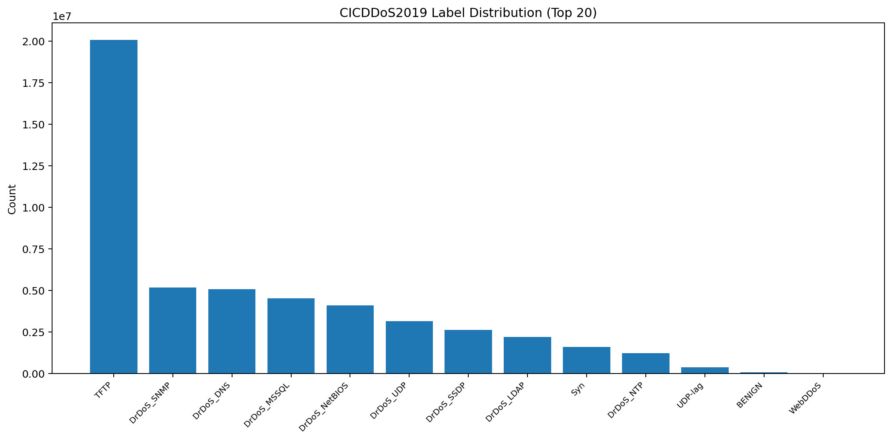
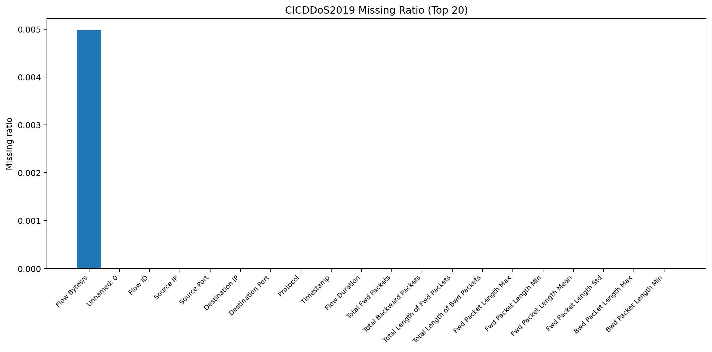
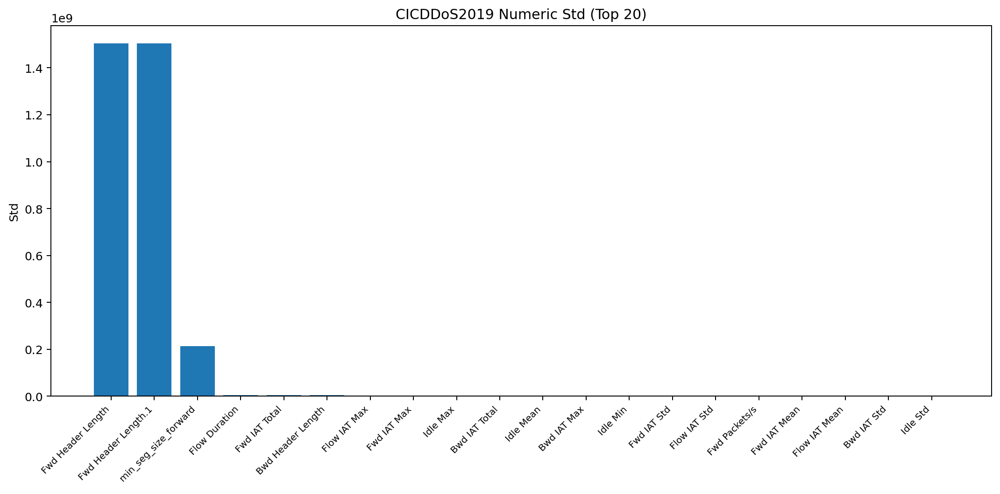
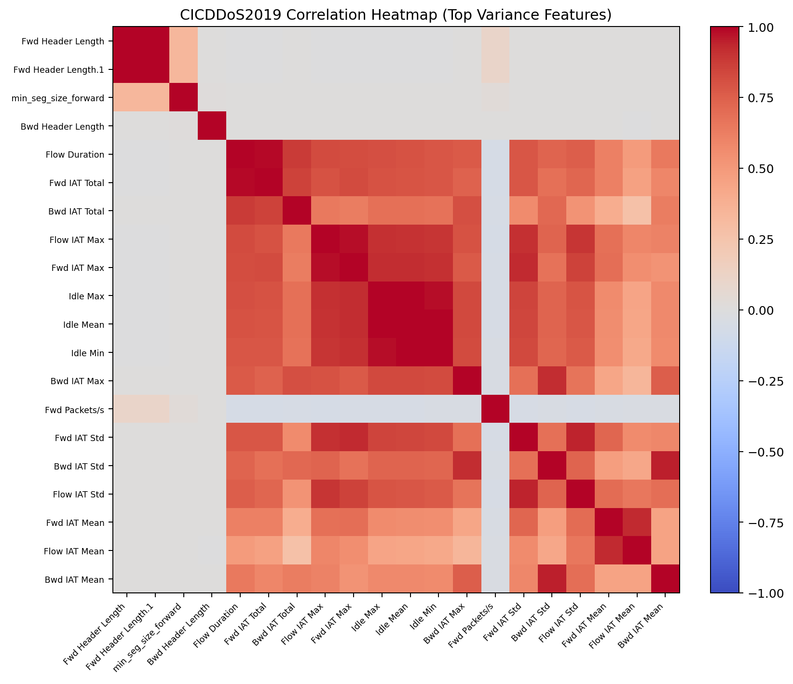
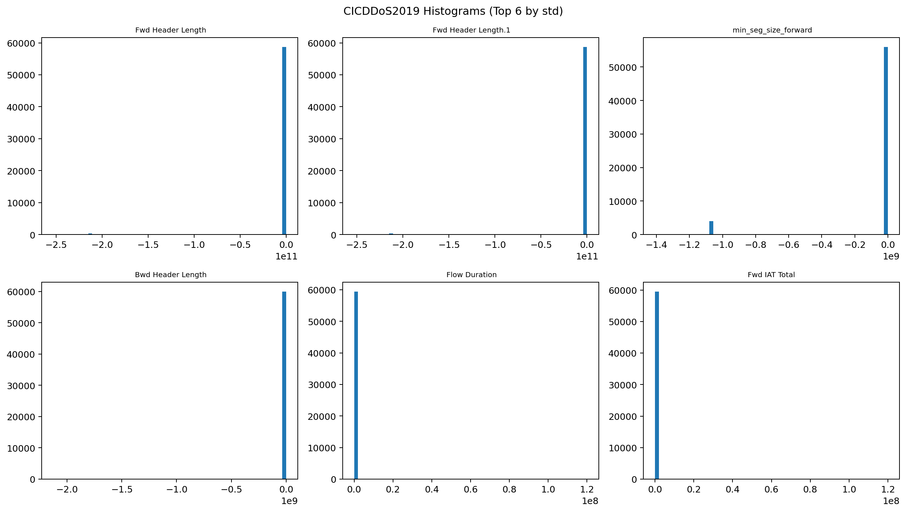
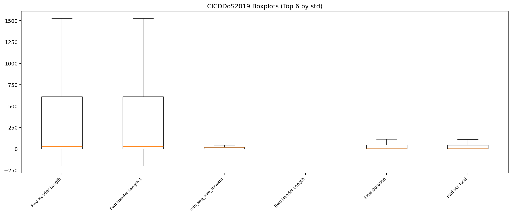

# CICDDoS2019 EDA

## 数据概览

- 文件数: 11
- 总样本数: 50,063,112
- 列数: 88
- 标签列: ` Label`
- 总文件大小: 20.78 GB

| 文件 | 大小(GB) |
|---|---:|
| DrDoS_DNS.csv | 1.987 |
| DrDoS_LDAP.csv | 0.854 |
| DrDoS_MSSQL.csv | 1.759 |
| DrDoS_NTP.csv | 0.601 |
| DrDoS_NetBIOS.csv | 1.581 |
| DrDoS_SNMP.csv | 2.023 |
| DrDoS_SSDP.csv | 1.167 |
| DrDoS_UDP.csv | 1.403 |
| Syn.csv | 0.594 |
| TFTP.csv | 8.663 |
| UDPLag.csv | 0.147 |

## 缺失值 Top 20

| 列名 | 缺失数量 | 缺失率 |
|---|---:|---:|
| Flow Bytes/s | 249,024 | 0.50% |
| Unnamed: 0 | 0 | 0.00% |
| Flow ID | 0 | 0.00% |
|  Source IP | 0 | 0.00% |
|  Source Port | 0 | 0.00% |
|  Destination IP | 0 | 0.00% |
|  Destination Port | 0 | 0.00% |
|  Protocol | 0 | 0.00% |
|  Timestamp | 0 | 0.00% |
|  Flow Duration | 0 | 0.00% |
|  Total Fwd Packets | 0 | 0.00% |
|  Total Backward Packets | 0 | 0.00% |
| Total Length of Fwd Packets | 0 | 0.00% |
|  Total Length of Bwd Packets | 0 | 0.00% |
|  Fwd Packet Length Max | 0 | 0.00% |
|  Fwd Packet Length Min | 0 | 0.00% |
|  Fwd Packet Length Mean | 0 | 0.00% |
|  Fwd Packet Length Std | 0 | 0.00% |
| Bwd Packet Length Max | 0 | 0.00% |
|  Bwd Packet Length Min | 0 | 0.00% |

## 标签分布 Top 20

| 标签 | 数量 | 占比 |
|---|---:|---:|
| TFTP | 20,082,580 | 40.11% |
| DrDoS_SNMP | 5,159,870 | 10.31% |
| DrDoS_DNS | 5,071,011 | 10.13% |
| DrDoS_MSSQL | 4,522,492 | 9.03% |
| DrDoS_NetBIOS | 4,093,279 | 8.18% |
| DrDoS_UDP | 3,134,645 | 6.26% |
| DrDoS_SSDP | 2,610,611 | 5.21% |
| DrDoS_LDAP | 2,179,930 | 4.35% |
| Syn | 1,582,289 | 3.16% |
| DrDoS_NTP | 1,202,642 | 2.40% |
| UDP-lag | 366,461 | 0.73% |
| BENIGN | 56,863 | 0.11% |
| WebDDoS | 439 | 0.00% |

## 数值特征统计 Top 20（按标准差）

| 列名 | count | mean | std | min | max | zero_ratio |
|---|---:|---:|---:|---:|---:|---:|
|  Fwd Header Length | 50,063,112 | -1.09e+08 | 1.504e+09 | -2.529e+11 | 1.559e+05 | 17.42% |
|  Fwd Header Length.1 | 50,063,112 | -1.09e+08 | 1.504e+09 | -2.529e+11 | 1.559e+05 | 17.42% |
|  min_seg_size_forward | 50,063,112 | -4.483e+07 | 2.136e+08 | -1.408e+09 | 1480 | 22.86% |
|  Flow Duration | 50,063,112 | 1.124e+06 | 5.507e+06 | 0 | 1.2e+08 | 2.72% |
| Fwd IAT Total | 50,063,112 | 1.123e+06 | 5.506e+06 | 0 | 1.2e+08 | 2.81% |
|  Bwd Header Length | 50,063,112 | -7323 | 3.942e+06 | -2.125e+09 | 1.473e+05 | 99.33% |
|  Flow IAT Max | 50,063,112 | 7.376e+05 | 2.083e+06 | 0 | 1.2e+08 | 2.72% |
|  Fwd IAT Max | 50,063,112 | 7.373e+05 | 2.082e+06 | 0 | 1.2e+08 | 2.81% |
|  Idle Max | 50,063,112 | 1.058e+05 | 1.729e+06 | 0 | 1.192e+08 | 99.55% |
| Bwd IAT Total | 50,063,112 | 2.79e+04 | 1.424e+06 | 0 | 1.2e+08 | 99.40% |
| Idle Mean | 50,063,112 | 7.829e+04 | 1.275e+06 | 0 | 1.192e+08 | 99.55% |
|  Bwd IAT Max | 50,063,112 | 2.109e+04 | 1.075e+06 | 0 | 1.197e+08 | 99.40% |
|  Idle Min | 50,063,112 | 5.875e+04 | 1.021e+06 | 0 | 1.192e+08 | 99.55% |
|  Fwd IAT Std | 50,063,112 | 4.028e+05 | 9.726e+05 | 0 | 6.737e+07 | 70.26% |
|  Flow IAT Std | 50,063,112 | 4.015e+05 | 9.585e+05 | 0 | 6.808e+07 | 69.80% |
| Fwd Packets/s | 50,063,112 | 1.066e+06 | 9.157e+05 | 0 | 4e+06 | 2.72% |
|  Fwd IAT Mean | 50,063,112 | 2.504e+05 | 6.467e+05 | 0 | 6.554e+07 | 2.81% |
|  Flow IAT Mean | 50,063,112 | 2.479e+05 | 6.21e+05 | 0 | 6.554e+07 | 2.72% |
|  Bwd IAT Std | 50,063,112 | 1.057e+04 | 5.583e+05 | 0 | 8.338e+07 | 99.92% |
|  Idle Std | 50,063,112 | 2.051e+04 | 4.202e+05 | 0 | 6.6e+07 | 99.64% |

## 可视化

### 标签分布 Top20

### 缺失率 Top20

### 标准差 Top20

### 相关性热力图 Top20

### 直方图 Top6

### 箱线图 Top6

## 结论与建议

- 优先处理类别不平衡：训练时建议分层采样并使用类别权重。
- 高缺失率列需评估删除或独立缺失编码。
- 高相关特征可做相关阈值筛除，降低冗余。
- 数值长尾较重时建议采用 `log1p` 或分位数截断。

## 产物说明

- `progress.log`: 实时进度日志。
- `*.png`: 各类可视化图。
- `eda.md`: 本数据集 EDA 文档。
