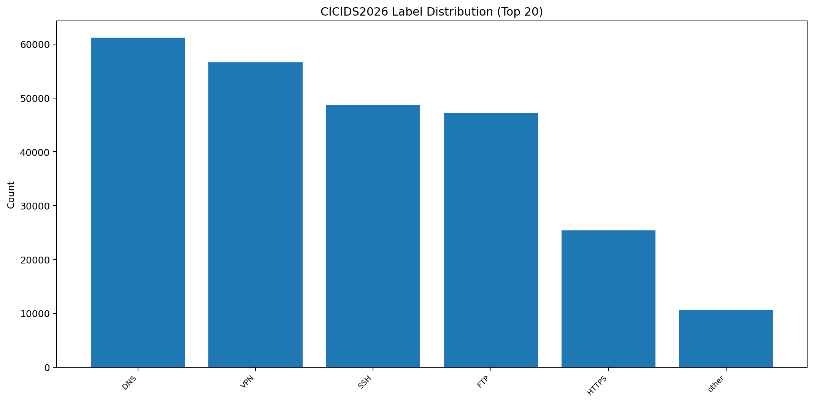
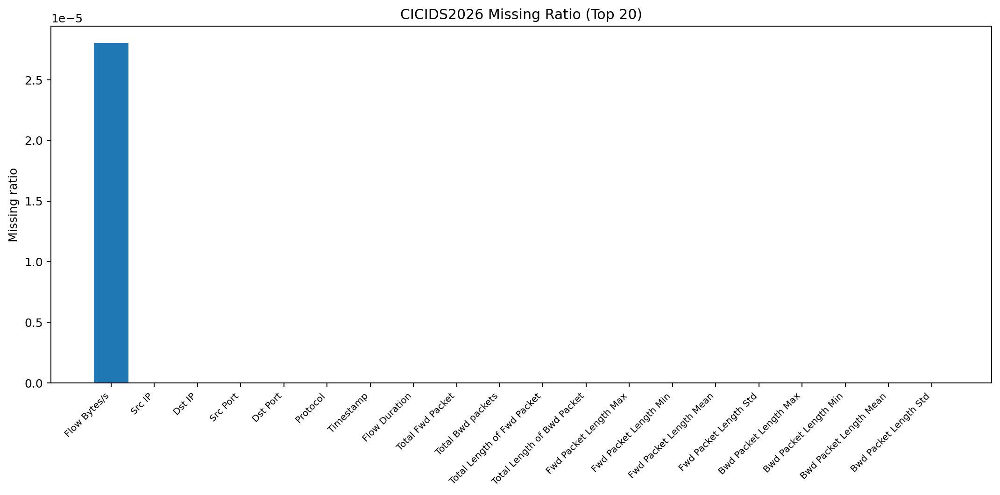
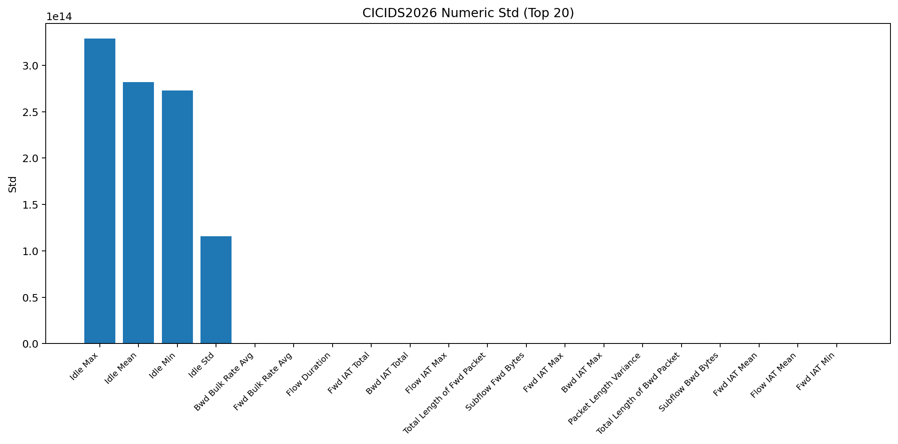
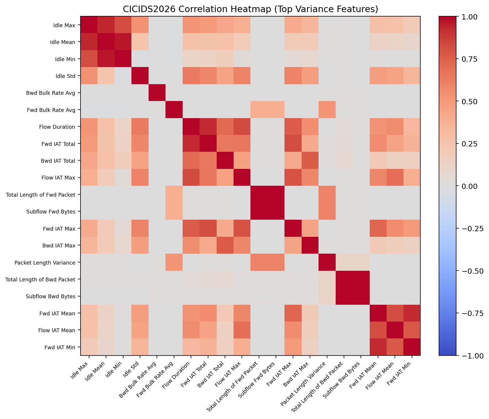
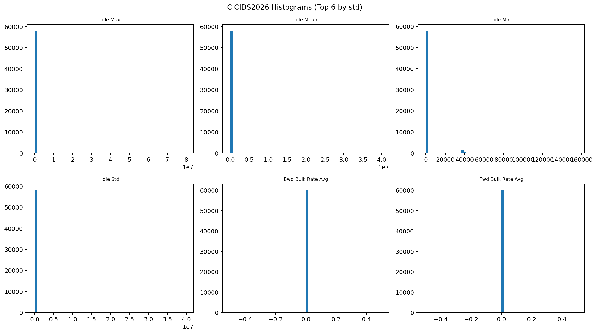
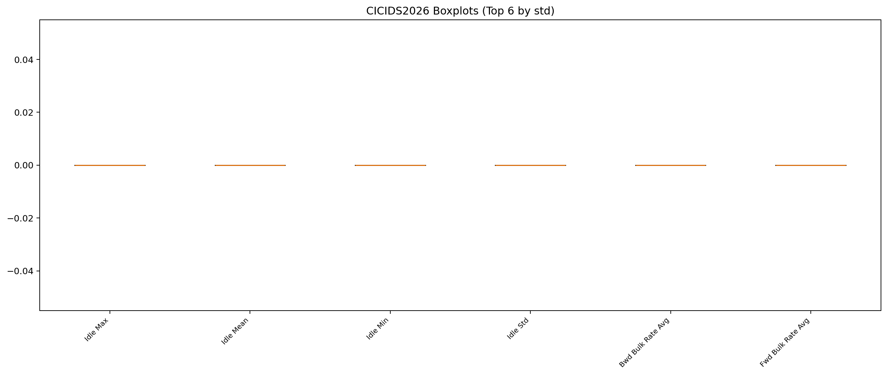

# CICIDS2026 EDA

## 数据概览

- 文件数: 1
- 总样本数: 249,792
- 列数: 83
- 标签列: `Label`
- 总文件大小: 0.09 GB

| 文件 | 大小(GB) |
|---|---:|
| cicids2026.csv | 0.094 |

## 缺失值 Top 20

| 列名 | 缺失数量 | 缺失率 |
|---|---:|---:|
| Flow Bytes/s | 7 | 0.00% |
| Src IP | 0 | 0.00% |
| Dst IP | 0 | 0.00% |
| Src Port | 0 | 0.00% |
| Dst Port | 0 | 0.00% |
| Protocol | 0 | 0.00% |
| Timestamp | 0 | 0.00% |
| Flow Duration | 0 | 0.00% |
| Total Fwd Packet | 0 | 0.00% |
| Total Bwd packets | 0 | 0.00% |
| Total Length of Fwd Packet | 0 | 0.00% |
| Total Length of Bwd Packet | 0 | 0.00% |
| Fwd Packet Length Max | 0 | 0.00% |
| Fwd Packet Length Min | 0 | 0.00% |
| Fwd Packet Length Mean | 0 | 0.00% |
| Fwd Packet Length Std | 0 | 0.00% |
| Bwd Packet Length Max | 0 | 0.00% |
| Bwd Packet Length Min | 0 | 0.00% |
| Bwd Packet Length Mean | 0 | 0.00% |
| Bwd Packet Length Std | 0 | 0.00% |

## 标签分布 Top 20

| 标签 | 数量 | 占比 |
|---|---:|---:|
| DNS | 61,241 | 24.52% |
| VPN | 56,644 | 22.68% |
| SSH | 48,657 | 19.48% |
| FTP | 47,250 | 18.92% |
| HTTPS | 25,384 | 10.16% |
| other | 10,616 | 4.25% |

## 数值特征统计 Top 20（按标准差）

| 列名 | count | mean | std | min | max | zero_ratio |
|---|---:|---:|---:|---:|---:|---:|
| Idle Max | 249,792 | 6.927e+13 | 3.288e+14 | 0 | 1.63e+15 | 87.69% |
| Idle Mean | 249,792 | 5.538e+13 | 2.818e+14 | 0 | 1.63e+15 | 87.69% |
| Idle Min | 249,792 | 4.704e+13 | 2.729e+14 | 0 | 1.63e+15 | 87.69% |
| Idle Std | 249,792 | 1.331e+13 | 1.157e+14 | 0 | 1.15e+15 | 90.57% |
| Bwd Bulk Rate Avg | 249,792 | 1.281e+06 | 4.699e+07 | 0 | 6.63e+09 | 74.24% |
| Fwd Bulk Rate Avg | 249,792 | 5.809e+05 | 1.253e+07 | 0 | 4.73e+09 | 77.76% |
| Flow Duration | 249,792 | 1.181e+06 | 8.237e+06 | 0 | 1.2e+08 | 0.15% |
| Fwd IAT Total | 249,792 | 9.038e+05 | 7.523e+06 | 0 | 1.2e+08 | 25.41% |
| Bwd IAT Total | 249,792 | 6.228e+05 | 5.7e+06 | 0 | 1.2e+08 | 49.49% |
| Flow IAT Max | 249,792 | 6.533e+05 | 5.031e+06 | 0 | 1.19e+08 | 23.82% |
| Total Length of Fwd Packet | 249,792 | 1.325e+05 | 4.236e+06 | 0 | 1.303e+09 | 1.06% |
| Subflow Fwd Bytes | 249,792 | 1.316e+05 | 4.236e+06 | 0 | 1.303e+09 | 1.16% |
| Fwd IAT Max | 249,792 | 4.422e+05 | 4.142e+06 | 0 | 1.19e+08 | 25.41% |
| Bwd IAT Max | 249,792 | 3.218e+05 | 3.366e+06 | 0 | 1.19e+08 | 49.49% |
| Packet Length Variance | 249,792 | 2.083e+05 | 3.343e+06 | 0 | 4.023e+08 | 24.86% |
| Total Length of Bwd Packet | 249,792 | 2.804e+04 | 2.578e+06 | 0 | 1.031e+09 | 25.18% |
| Subflow Bwd Bytes | 249,792 | 2.085e+04 | 2.569e+06 | 0 | 1.031e+09 | 25.20% |
| Fwd IAT Mean | 249,792 | 1.341e+05 | 2.115e+06 | 0 | 1.16e+08 | 25.41% |
| Flow IAT Mean | 249,792 | 1.698e+05 | 1.995e+06 | 0 | 1.16e+08 | 23.82% |
| Fwd IAT Min | 249,792 | 7.862e+04 | 1.902e+06 | -0.000131 | 1.16e+08 | 91.68% |

## 可视化

### 标签分布 Top20

### 缺失率 Top20

### 标准差 Top20

### 相关性热力图 Top20

### 直方图 Top6

### 箱线图 Top6

## 结论与建议

- 优先处理类别不平衡：训练时建议分层采样并使用类别权重。
- 高缺失率列需评估删除或独立缺失编码。
- 高相关特征可做相关阈值筛除，降低冗余。
- 数值长尾较重时建议采用 `log1p` 或分位数截断。

## 产物说明

- `progress.log`: 实时进度日志。
- `*.png`: 各类可视化图。
- `eda.md`: 本数据集 EDA 文档。
