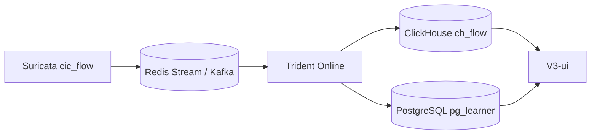

# Trident Demo 实时数据库设计

本文档面向 Trident 的实时流量接入形态：Suricata 持续写入 Redis Stream / Kafka，Trident 持续消费、推理、创建/更新学习器，并把当前学习器状态同步给前端。

设计原则很简单：**先立住两张核心表**。

| 核心表 | 数据库 | 作用 |
|--------|--------|------|
| `ch_flow` | ClickHouse | 每条实时网络流，以及 Trident 对这条流的分配结果 |
| `pg_learner` | PostgreSQL | 每个学习器的当前状态、画像、指标、规则和风险 |

其他窗口统计、风险告警、拓扑快照、性能指标都可以作为派生表或后续优化，不应该成为第一版 schema 的中心。

实时前提：

- 系统长期在线运行，以连续窗口处理和周期性状态刷新为主。
- 实时流量没有真值类别，schema 只保存在线推理和行为画像所需字段。
- 主查询维度是 `session_id` + 时间范围。`session_id` 表示一次在线运行实例，可对应一次服务启动、一个模型配置版本或一个部署实例。

---

## 1. 核心数据流



写入关系：

| 阶段 | 写入表 | 说明 |
|------|--------|------|
| 消费到一条流 | `ch_flow` | 先写原始五元组、特征、MQ 溯源 |
| 推理完成 | `ch_flow` | 更新/写入 assigned learner、unknown、loss、window |
| 学习器创建/更新 | `pg_learner` | upsert 学习器状态、画像、风险、规则 |
| 周期性 Live flush | `pg_learner` | 刷新 metric/rule/topology/profile JSON 当前快照 |

---

## 2. 核心表一：`ch_flow`

`ch_flow` 是实时流事实表。它同时承接原始流字段和模型分配结果，避免在线查询时频繁 join 原始流表和分配表。

```sql
CREATE TABLE ch_flow (
  session_id        String,
  flow_uid          String,
  event_time        DateTime64(3),
  ingest_time       DateTime64(3) DEFAULT now64(3),

  -- 五元组
  src_ip            String,
  dst_ip            String,
  src_port          UInt16,
  dst_port          UInt16,
  protocol          UInt16,

  -- 特征：第一版原样 JSON 保存，避免特征变更牵动表结构
  feature_profile   LowCardinality(String) DEFAULT 'compact_stats_no_env',
  features_json     String DEFAULT '{}',

  -- Trident 分配结果
  assigned_learner  String DEFAULT '',
  is_unknown        UInt8 DEFAULT 0,
  window_index      UInt64,
  pred_loss         Nullable(Float64),
  threshold         Nullable(Float64),
  assignment_meta   String DEFAULT '',

  -- 溯源
  mq_type           LowCardinality(String), -- redis_stream | kafka
  mq_topic          String,
  mq_message_id     String,
  source_flow_id    String DEFAULT '',
  raw_event         String DEFAULT ''
)
ENGINE = MergeTree()
PARTITION BY toYYYYMM(event_time)
ORDER BY (session_id, event_time, flow_uid)
TTL event_time + INTERVAL 90 DAY;
```

### 流特征为什么用 JSON 字符串

第一版建议把流特征放在 `features_json` 里原样保存，而不是拆成几十个固定列。

原因：

- 实时特征集会变化，JSON 不需要频繁迁移表结构。
- 不同流可能字段缺失或字段集合不同。
- Trident 推理主要在应用层解析特征，数据库第一阶段只负责可靠存储和按时间/学习器查询。
- 真正高频查询的特征，等查询模式稳定后再抽成物化列或派生宽表。

示例：

```json
{
  "Flow Duration": 1205,
  "Total Fwd Packet": 8,
  "Total Bwd packets": 5,
  "Flow IAT Mean": 133.8
}
```

### `flow_uid` 生成规则

`flow_uid` 必须稳定，后续所有定位和去重都依赖它。

优先级：

1. Redis Stream：`{stream}:{message_id}`。
2. Kafka：`{topic}:{partition}:{offset}`。
3. 兜底：`sha256(session_id + timestamp + five_tuple + mq_message_id)`。

### 为什么不拆成 raw / assignment 两张表

第一版不建议拆。实时系统最常见的问题是：“这条流进来了没有？被哪个学习器处理了？是不是 unknown？”把原始流和分配结果放在同一张 CH 表里，查询路径最短。

如果后续写入链路需要先落原始流、稍后异步补充分配结果，可以采用以下两种方式之一：

- 仍写 `ch_flow`，用同一个 `flow_uid` 追加带分配结果的新版本，并在查询端取最新版本。
- 后续再拆 `ch_flow_raw` / `ch_flow_assignment`，但那是吞吐和写入模型稳定后的优化。

### `ch_flow` 字段说明

| 字段 | 类型 | 含义 | 示例 / 格式 |
|------|------|------|-------------|
| `session_id` | `String` | 在线运行实例 ID，用来区分不同服务启动、部署实例或模型配置版本。 | `trident-prod-20260526-001` |
| `flow_uid` | `String` | 每条流的稳定唯一 ID，用于定位、去重和回溯。 | `suricata:cic_flow:1716720000000-0` |
| `event_time` | `DateTime64(3)` | 流事件发生时间，通常来自 Suricata/cic_flow 时间戳。 | `2026-05-26 10:15:23.123` |
| `ingest_time` | `DateTime64(3)` | 写入 ClickHouse 的时间，默认 `now64(3)`。 | `2026-05-26 10:15:23.456` |
| `src_ip` | `String` | 源 IP，使用字符串以兼容 IPv4 / IPv6。 | `192.168.1.10` |
| `dst_ip` | `String` | 目的 IP，使用字符串以兼容 IPv4 / IPv6。 | `8.8.8.8` |
| `src_port` | `UInt16` | 源端口，范围 0-65535。 | `51544` |
| `dst_port` | `UInt16` | 目的端口，范围 0-65535。 | `443` |
| `protocol` | `UInt16` | IP 协议号。常见值：TCP=6，UDP=17。 | `6` |
| `feature_profile` | `LowCardinality(String)` | 特征集名称，说明 `features_json` 使用哪套特征定义。 | `compact_stats_no_env` |
| `features_json` | `String` | 流特征 JSON 字符串，保存模型推理用的数值特征。 | `{"Flow Duration":1205}` |
| `assigned_learner` | `String` | Trident 将该流分配给的学习器。未分配时为空字符串。 | `BENIGN_BASELINE` / `NEW_3` |
| `is_unknown` | `UInt8` | 是否未被现有学习器接受。`1` 表示进入 unknown buffer。 | `0` / `1` |
| `window_index` | `UInt64` | 该流所属的处理窗口编号。 | `1024` |
| `pred_loss` | `Nullable(Float64)` | 模型对该流的重构误差或异常分数，可为空。 | `0.3842` |
| `threshold` | `Nullable(Float64)` | 当前学习器接受样本的阈值，可为空。 | `0.5120` |
| `assignment_meta` | `String` | 分配过程补充信息，建议存 JSON 字符串，用于 debug route、accepted learners、margin 等。 | `{"accepted":["L1"]}` |
| `mq_type` | `LowCardinality(String)` | 消息队列类型。 | `redis_stream` / `kafka` |
| `mq_topic` | `String` | 消息队列 stream/topic 名。 | `suricata:cic_flow` |
| `mq_message_id` | `String` | MQ 中的消息 ID。 | `1716720000000-0` |
| `source_flow_id` | `String` | 上游 Suricata 或流量系统自带的 flow id，没有时为空。 | `123456789` |
| `raw_event` | `String` | 原始事件 JSON 字符串，用于回溯上游日志。 | `{"event_type":"cic_flow"}` |
 
补充说明：

- `pred_loss <= threshold` 通常表示该学习器接受该流。
- `is_unknown=1` 的流后续可能参与 unknown 聚类和新学习器创建。
- `features_json` 和 `raw_event` 都是 JSON 字符串，但用途不同：前者是模型特征，后者是原始事件。

---

## 3. 核心表二：`pg_learner`

`pg_learner` 是学习器当前状态表。前端学习器列表、详情页、风险列表的大部分信息都应该优先从这里读。

```sql
CREATE TABLE pg_learner (
  id                    BIGSERIAL PRIMARY KEY,
  session_id            VARCHAR(256) NOT NULL,
  learner_name          VARCHAR(512) NOT NULL,

  learner_status        VARCHAR(16) NOT NULL DEFAULT 'active',
  -- active | cooling_down | retired | merged

  -- 生命周期
  creation_window_index BIGINT,
  last_seen_window_index BIGINT,
  created_at            TIMESTAMPTZ NOT NULL DEFAULT NOW(),
  last_seen_at          TIMESTAMPTZ,
  updated_at            TIMESTAMPTZ NOT NULL DEFAULT NOW(),

  -- 规模与分配
  flow_count            BIGINT NOT NULL DEFAULT 0,
  assignment_share      DOUBLE PRECISION,
  unknown_absorb_count  BIGINT DEFAULT 0,

  -- 风险
  risk_score            DOUBLE PRECISION,
  risk_band             VARCHAR(32),
  risk_reason           TEXT,
  risk_version          VARCHAR(64) DEFAULT 'unset',

  -- 当前快照 JSON
  profile_json          JSONB, -- 行为画像、特征统计、端口/时序/协议统计
  metric_json           JSONB, -- 拓扑行为指标
  rule_json             JSONB, -- 规则命中结果
  topology_json         JSONB, -- 学习器内部/邻接拓扑摘要

  UNIQUE (session_id, learner_name)
);

CREATE INDEX idx_pg_learner_session ON pg_learner(session_id);
CREATE INDEX idx_pg_learner_status ON pg_learner(session_id, learner_status);
CREATE INDEX idx_pg_learner_risk ON pg_learner(session_id, risk_score DESC);
CREATE INDEX idx_pg_learner_profile_gin ON pg_learner USING GIN (profile_json);
CREATE INDEX idx_pg_learner_metric_gin ON pg_learner USING GIN (metric_json);
CREATE INDEX idx_pg_learner_rule_gin ON pg_learner USING GIN (rule_json);
```

### 为什么把 profile / metric / rule / topology 放进 JSON

第一版的重点是让在线链路稳定。学习器画像、拓扑指标、规则结果的字段会快速迭代，如果一开始全部拆成十几张关系表，会让写入链路和迁移成本变高。

因此第一版采用：

- 常用排序过滤字段直接列化：`risk_score`、`risk_band`、`flow_count` 等。
- 复杂结构完整放 JSON：`profile_json`、`metric_json`、`rule_json`、`topology_json`。
- 等前端查询模式稳定后，再把高频字段拆到派生表。

不建议在第一版把 `protocol_cluster_type`、`temporal_cluster_type`、`port_cluster_type` 这类定性标签做成固定列。它们不是 Trident 主流程稳定产出的原始事实，而是规则层或审计层基于统计结果解释出来的标签。第一版应放在 `profile_json` 或 `rule_json` 中，等标签体系稳定、且前端确实需要按这些标签高频筛选时，再提升为独立列。

同理，第一版不把 `stability_score` 和 `drift_score` 做成固定列。当前主流程还没有稳定定义这两个分数的计算公式，也没有保证每次 Live flush 都会产出它们。如果后续要做，可以先作为实验性指标放在 `metric_json` 里，例如 `metric_json.stability_score`、`metric_json.drift_score`，等公式稳定并成为高频排序/过滤条件后再提升为独立列。

### `pg_learner` 字段说明

| 字段 | 类型 | 含义 | 示例 / 格式 |
|------|------|------|-------------|
| `id` | `BIGSERIAL` | PostgreSQL 内部自增主键。业务定位优先使用 `session_id + learner_name`。 | `42` |
| `session_id` | `VARCHAR(256)` | 在线运行实例 ID，对应 `ch_flow.session_id`。 | `trident-prod-20260526-001` |
| `learner_name` | `VARCHAR(512)` | 学习器名称。 | `BENIGN_BASELINE` / `NEW_1` |
| `learner_status` | `VARCHAR(16)` | 学习器状态。建议值：`active`、`cooling_down`、`retired`、`merged`。 | `active` |
| `creation_window_index` | `BIGINT` | 学习器在哪个窗口被创建。 | `12` |
| `last_seen_window_index` | `BIGINT` | 最近一次吸收或匹配流量的窗口编号。 | `1024` |
| `created_at` | `TIMESTAMPTZ` | 学习器创建时间。 | `2026-05-26 10:15:23+08` |
| `last_seen_at` | `TIMESTAMPTZ` | 最近活跃时间。 | `2026-05-26 10:20:01+08` |
| `updated_at` | `TIMESTAMPTZ` | 最近一次写入/刷新该行的时间。 | `2026-05-26 10:20:30+08` |
| `flow_count` | `BIGINT` | 当前累计分配到该学习器的流数量。 | `128394` |
| `assignment_share` | `DOUBLE PRECISION` | 该学习器占当前 session 总分配流量的比例，通常为 0-1。 | `0.23` |
| `unknown_absorb_count` | `BIGINT` | 该学习器从 unknown 聚类创建或吸收的流数量。 | `2300` |
| `risk_score` | `DOUBLE PRECISION` | 当前风险分数。 | `0.82` |
| `risk_band` | `VARCHAR(32)` | 当前风险等级。 | `LOW` / `MEDIUM` / `HIGH` |
| `risk_reason` | `TEXT` | 风险解释文本，给前端和研判人员阅读。 | `high port concentration with bursty traffic` |
| `risk_version` | `VARCHAR(64)` | 风险评分公式或规则版本。用于追溯 `risk_score` 和 `risk_band` 是按哪套逻辑生成的。 | `rule_weighted_v1` |
| `profile_json` | `JSONB` | 学习器行为画像快照，保存协议、端口、时间、特征分布等统计画像。 | `{"protocol":{"tcp_ratio":0.97}}` |
| `metric_json` | `JSONB` | 从画像和拓扑里计算出来的指标值，只放数值型或可比较的指标。 | `{"dst_port_entropy":0.21}` |
| `rule_json` | `JSONB` | 基于 `profile_json` 和 `metric_json` 产生的规则命中结果、证据和解释。 | `{"rules":[...]}` |
| `topology_json` | `JSONB` | 为前端展示和人工研判准备的拓扑摘要，保存 top 节点、top 边、top 端口等结构。 | `{"top_hosts":[...]}` |

### 风险字段怎么来

`risk_score` 和 `risk_band` 可以保留为 `pg_learner` 固定列，因为风险列表、学习器排序、风险筛选会高频使用它们。但它们不是 Trident 原始模型直接输出的字段，也不是有标签分类概率。实时接入后没有真实标签，因此风险字段只能来自无监督画像、拓扑指标和规则命中结果。

第一版建议采用规则加权方式生成风险分：

```text
risk_score = clamp(
  sum(rule_weight * match_strength * confidence) / sum(rule_weight),
  0,
  1
)
```

其中：

- `rule_weight`：规则权重，由规则配置给出。
- `match_strength`：命中强度，建议 `strong = 1.0`、`weak = 0.5`。
- `confidence`：证据置信度，没有置信度时默认 `1.0`。
- `clamp`：把结果限制在 0-1。

如果当前 Live flush 没有执行风险规则，`risk_score` 应为 `NULL`，`risk_band` 应为 `UNKNOWN` 或为空；不要用 `0` 表示“没算”。`0` 应该只表示“已经计算，且当前规则认为风险很低”。

第一版风险等级可以采用固定阈值：

| 条件 | `risk_band` |
|------|-------------|
| `risk_score IS NULL` | `UNKNOWN` |
| `risk_score >= 0.75` | `HIGH` |
| `risk_score >= 0.45` | `MEDIUM` |
| `risk_score < 0.45` | `LOW` |

这些阈值必须和 `risk_version` 绑定。比如 `risk_version = rule_weighted_v1` 表示当前分数来自第一版规则加权公式；如果后续改成分位数风险等级、模型融合风险分或人工校准风险分，只更新 `risk_version` 和计算逻辑，不改变表结构。

`risk_reason` 是给前端和研判人员看的短解释，应该由最高贡献规则或最关键证据生成。例如：

```text
HIGH: 目的端口熵低，目的 IP 集中度高，且该学习器近期吸收 unknown 流量较多。
```

更完整的证据不要塞进 `risk_reason`，应该保存在 `rule_json` 里。

### 四类学习器 JSON 的边界

这四个字段都在 `pg_learner` 里，但用途不同，不能混着放。

`profile_json` 保存“这个学习器的流量长什么样”。它更接近画像统计，例如 TCP/UDP 占比、目的端口分布、流持续时间分布、包数/字节数分布、活跃时间段等。这里可以放定性标签的来源数据，也可以临时放尚未稳定的画像标签。

示例：

```json
{
  "protocol": {
    "tcp_ratio": 0.97,
    "udp_ratio": 0.03
  },
  "port": {
    "top_dst_ports": [443, 80, 8080],
    "distinct_dst_ports": 18
  },
  "temporal": {
    "active_span_seconds": 3600,
    "burst_score": 0.72
  }
}
```

`metric_json` 保存“从画像或拓扑中计算出的指标值”。它应该尽量是可排序、可比较、可阈值判断的数值或小型数组，例如端口熵、端点集中度、边集中度、主机度分布摘要。它不是给前端画图的完整结构，而是给规则判断和风险评分使用的指标快照。

示例：

```json
{
  "dst_port_entropy": 0.21,
  "dst_ip_concentration": 0.84,
  "edge_concentration": 0.78,
  "stability_score": null,
  "drift_score": null,
  "host_degree": {
    "max": 42,
    "p95": 9
  }
}
```

其中 `stability_score` 和 `drift_score` 目前不是数据库层已经确定的字段，也不是主流程已定义好的固定公式。建议先按如下原则处理：

- 没有公式前，不写入固定列，也不要让前端依赖它们。
- 需要实验时，先写入 `metric_json`，并附带 `metric_version` 或公式说明。
- 公式稳定后，如果确实需要按稳定性/漂移排序，再把它们提升为 `pg_learner` 独立列。

候选含义可以这样定义，但这属于后续指标层工作：

- 稳定性分数：衡量一个学习器在最近多个窗口中的流量规模、端口分布、协议分布、拓扑邻接关系是否稳定。
- 漂移分数：衡量当前窗口画像相对历史基线变化有多大，例如端口分布 JS 散度、协议占比变化、top edge 变化、重构误差分布变化等。

`rule_json` 保存“这些指标触发了什么判断”。它不是重新保存全部指标，而是记录命中的规则、强弱匹配、证据字段和解释文本。比如 `dst_port_entropy` 很低、`dst_ip_concentration` 很高，规则层可以判断该学习器像固定服务访问；如果目的端口数量异常高，可能判断为扫描倾向。

示例：

```json
{
  "rules": [
    {
      "rule_id": "LOW_PORT_ENTROPY",
      "match": "strong",
      "evidence": {
        "dst_port_entropy": 0.21
      },
      "explain": "目的端口高度集中"
    }
  ]
}
```

`topology_json` 保存“学习器级别概览拓扑摘要”。它可以包含 top host、top port、top edge 等轻量结构，用于学习器详情页的概览区和人工研判的快速扫视。

需要特别注意：`topology_json` 不作为“选中一个 IP 后展示其相关拓扑图”的数据源。IP 中心拓扑图是交互式查询，应该从 `ch_flow` 按 `session_id + assigned_learner + 时间范围 + ip` 动态聚合；如果动态聚合性能不足，再新增 ClickHouse 派生表 `ch_ip_edge`。也就是说：

- `pg_learner.topology_json` 负责学习器整体概览。
- `ch_flow` 负责按 IP、时间范围、学习器动态查询。
- `ch_ip_edge` 只在性能需要时作为 IP 交互拓扑的预聚合表。

IP 交互拓扑查询示例：

```sql
SELECT
  src_ip,
  dst_ip,
  dst_port,
  protocol,
  count() AS flow_count,
  min(event_time) AS first_seen,
  max(event_time) AS last_seen
FROM ch_flow
WHERE session_id = {session_id:String}
  AND assigned_learner = {learner_name:String}
  AND event_time >= {start_time:DateTime64(3)}
  AND event_time < {end_time:DateTime64(3)}
  AND (src_ip = {ip:String} OR dst_ip = {ip:String})
GROUP BY src_ip, dst_ip, dst_port, protocol
ORDER BY flow_count DESC
LIMIT 500;
```

示例：

```json
{
  "top_hosts": [
    {"ip": "10.0.0.5", "flow_count": 1200},
    {"ip": "10.0.0.8", "flow_count": 840}
  ],
  "top_ports": [
    {"port": 443, "flow_count": 1800}
  ],
  "top_edges": [
    {"src_ip": "10.0.0.5", "dst_ip": "8.8.8.8", "flow_count": 320}
  ]
}
```

简单说：`profile_json` 是画像统计，`metric_json` 是指标数值，`rule_json` 是判断结果，`topology_json` 是展示和研判用的拓扑摘要。

补充说明：

- `pg_learner` 保存的是“当前状态”，不是每个窗口的历史明细。
- 每次 Live flush 都应按 `session_id + learner_name` 幂等更新同一行。
- 如果未来需要保存学习器历史变化，再新增 learner history 表，而不是让 `pg_learner` 膨胀成历史表。

---

## 4. 最小在线写入流程

```text
1. Trident 服务启动
   -> 生成 session_id

2. 消费 Redis / Kafka 流
   -> INSERT ch_flow（原始五元组、特征、MQ 溯源）

3. 窗口推理完成
   -> 写入/补充 ch_flow.assigned_learner、is_unknown、loss、window_index
   -> UPSERT pg_learner（学习器规模、状态、last_seen）

4. Live flush 周期到达
   -> 重新计算当前学习器画像、指标、规则、拓扑
   -> UPSERT pg_learner.profile_json / metric_json / rule_json / topology_json
   -> 更新 pg_learner.risk_score / risk_band / risk_reason / risk_version
```

---

## 5. Live flush 是什么

Live flush 是在线系统运行过程中，把内存里的“当前学习器状态快照”周期性写入 PostgreSQL。

它不是原始流写入。原始流持续进入 `ch_flow`。

Live flush 写的是聚合后的当前状态，例如：

- 当前有哪些学习器
- 每个学习器吸收了多少流
- 学习器的协议/端口/时序画像
- 拓扑行为指标
- 规则命中结果
- 当前风险分数和风险原因
- 当前拓扑摘要

触发方式可以是：

- 每 N 个窗口 flush 一次。
- 每 N 秒 flush 一次。
- 学习器创建、合并、退休等关键事件发生时立即 flush。

关键要求是**幂等**：同一个 `session_id + learner_name` 被反复 flush 时，应该更新同一行 `pg_learner`，而不是插入重复学习器。

---

## 6. 可选派生表

第一版可以不建这些表。只有当查询或 UI 性能需要时再拆。

### 6.1 `ch_ip_edge`

IP 中心拓扑图的预聚合边表。只有当直接从 `ch_flow` 动态聚合无法满足前端交互性能时才需要创建。

```sql
CREATE TABLE ch_ip_edge (
  session_id        String,
  window_index      UInt64,
  assigned_learner  String,
  src_ip            String,
  dst_ip            String,
  dst_port          UInt16,
  protocol          UInt16,
  flow_count        UInt64,
  first_seen        DateTime64(3),
  last_seen         DateTime64(3),
  updated_at        DateTime64(3) DEFAULT now64(3)
)
ENGINE = SummingMergeTree(flow_count)
ORDER BY (session_id, assigned_learner, window_index, src_ip, dst_ip, dst_port, protocol);
```

查询某个 IP 的邻接拓扑时，条件仍然是 `src_ip = ip OR dst_ip = ip`，但扫描的是预聚合后的边而不是原始流。

### 6.2 `ch_window_stats`

窗口级吞吐和性能曲线。如果前端需要独立绘制窗口性能趋势，可从 `ch_flow` 聚合，也可单独落表。

```sql
CREATE TABLE ch_window_stats (
  session_id                 String,
  window_index               UInt64,
  window_left_time           DateTime64(3),
  window_right_time          DateTime64(3),
  window_flow_count          UInt64,
  learner_count              UInt32,
  unknown_buffer             UInt32,
  detect_ms                  Float64,
  cluster_ms                 Float64,
  create_learner_ms          Float64,
  retrain_ms                 Float64,
  window_total_ms            Float64,
  new_learner_count          UInt32,
  incremental_update_count   UInt32,
  created_at                 DateTime64(3) DEFAULT now64(3)
)
ENGINE = MergeTree()
ORDER BY (session_id, window_index);
```

### 6.3 `pg_risk_alert`

如果风险需要工单式处置，再从 `pg_learner.risk_*` 拆出风险告警表。

```sql
CREATE TABLE pg_risk_alert (
  id              BIGSERIAL PRIMARY KEY,
  session_id      VARCHAR(256) NOT NULL,
  learner_name    VARCHAR(512) NOT NULL,
  trigger_time    TIMESTAMPTZ NOT NULL DEFAULT NOW(),
  risk_score      DOUBLE PRECISION,
  risk_band       VARCHAR(32),
  risk_version    VARCHAR(64),
  title           VARCHAR(256) NOT NULL,
  description     TEXT,
  evidence_json   JSONB,
  status          VARCHAR(16) DEFAULT 'open',
  created_at      TIMESTAMPTZ NOT NULL DEFAULT NOW(),
  updated_at      TIMESTAMPTZ NOT NULL DEFAULT NOW(),
  UNIQUE (session_id, learner_name, title)
);
```

### 6.4 `pg_session`

如果需要前端展示服务运行状态或多实例管理，再建 session 表。否则 `session_id` 可以先由服务配置或环境变量管理。

```sql
CREATE TABLE pg_session (
  id                    BIGSERIAL PRIMARY KEY,
  session_id            VARCHAR(256) NOT NULL UNIQUE,
  deployment_id         VARCHAR(128),
  status                VARCHAR(16) NOT NULL DEFAULT 'active',
  input_source          VARCHAR(32) NOT NULL,
  mq_topic              VARCHAR(128) NOT NULL,
  total_flows_seen      BIGINT DEFAULT 0,
  current_learner_count INT DEFAULT 0,
  unknown_buffer_size   INT DEFAULT 0,
  started_at            TIMESTAMPTZ NOT NULL DEFAULT NOW(),
  last_heartbeat_at     TIMESTAMPTZ NOT NULL DEFAULT NOW(),
  stopped_at            TIMESTAMPTZ,
  updated_at            TIMESTAMPTZ NOT NULL DEFAULT NOW()
);
```

---

## 7. API 建议

第一版 API 也围绕两张核心表：

| 方法 | 路径 | 数据源 |
|------|------|--------|
| GET | `/trident-api/flows` | `ch_flow` |
| GET | `/trident-api/learners` | `pg_learner` |
| GET | `/trident-api/learners/{name}` | `pg_learner` |
| GET | `/trident-api/learners/{name}/flows` | `ch_flow` |
| GET | `/trident-api/risks` | `pg_learner` 或 `pg_risk_alert` |

---

## 8. 落地优先级

| 阶段 | 内容 |
|------|------|
| P0 | 建 `ch_flow` 和 `pg_learner`，打通实时写入 |
| P1 | 实现 Live flush，周期性更新 `pg_learner` 的 JSON 快照和风险字段 |
| P2 | 前端改为读取 `ch_flow` / `pg_learner` |
| P3 | 根据真实查询压力再拆 `ch_window_stats`、`pg_risk_alert` 等派生表 |
