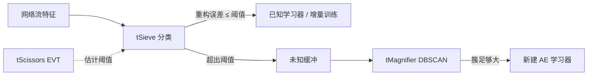
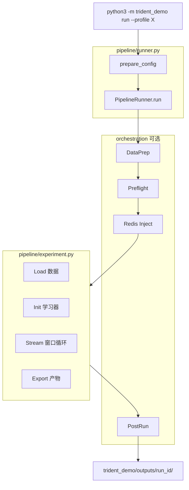

# Trident Demo 项目介绍

本文档是 `trident_demo/` 的**完整技术说明**，涵盖设计目标、目录结构、运行流程、算法核心、配置与产物。快速上手见 [`../../README.md`](../../README.md)。

---

## 1. 项目定位

`trident_demo` 是 Trident 流式异常检测系统的 **独立 Demo 栈**，解决原仓库主流程入口分散的问题：

| 原有问题 | Demo 方案 |
|----------|-----------|
| `main.py`、`benchmark_*.py`、多个 shell 脚本各自为政 | **一条 CLI** 覆盖全部主流程 |
| `experiment.py` 单文件 5000+ 行，难以导航 | 按职责拆分到 `pipeline/`、`orchestration/`、`core/` 等 |
| 研究与 Demo 代码耦合 | 复制 legacy 逻辑到独立包，**零 import** 旧模块 |

### 设计原则

1. **完全解耦**：`trident_demo/` 内禁止 `import trident_stream`、`import scripts` 等；可通过 `bash trident_demo/testing/scripts/check_decoupling.sh` 验证。
2. **逻辑一致**：核心代码从 `trident_stream/experiment.py` 及引擎模块**复制**而来，算法与产物 schema 与 legacy 对齐。
3. **不修改原目录**：`trident_stream/`、`main.py`、`scripts/` 保持不动，legacy 路径仍可用于对照实验。
4. **单入口编排**：`python3 -m trident_demo run --profile <name>` 自动完成前置（Redis、数据准备）→ 实验 → 后置摘要。

### 与 Legacy 的关系

```
原仓库（只读 / 对照）              trident_demo（推荐 Demo 入口）
─────────────────────              ─────────────────────────────
main.py                    →       run --profile batch
benchmark_trident_performance.py → run --profile benchmark
run_static_suricata_redis_benchmark.sh → run --profile replay
run_aligned_viz_pipeline.sh →      run --profile viz-demo
```

---

## 2. 算法背景（Trident 三件套）

Demo 实现的是 **流式单类 AE + EVT 阈值 + 未知聚类新类发现** 管线：



| 模块 | 文件 | 职责 |
|------|------|------|
| **tSieve** | `core/tsieve.py` | U-Net 风格 AE；多学习器注册；批量分类；增量/新建训练 |
| **tScissors** | `core/tscissors.py` | POT/EVT 估计重构误差阈值（样本不足时回退分位数） |
| **tMagnifier** | `core/tmagnifier.py` | 未知样本缓冲；DBSCAN 聚类；满足 `new_class_min_size` 时提议新类 |

默认数据源为 CICIDS 系列 CSV 或 Suricata EVE 格式的 Redis Stream（`suricata:cic_flow`）。

---

## 3. 目录结构

```
trident_demo/
├── README.md                 # 快速命令参考
├── cli.py                    # CLI 入口（argparse）
├── __main__.py               # python3 -m trident_demo
│
├── docs/                     # 文档
│   ├── flows/                # 数据流 / Redis 流式处理说明
│   ├── architecture/         # 三服务架构 / 改造方案 / 目录职责
│   └── reference/            # 完整项目指南 / 数据库设计
│
├── services/                 # Suricata / Redis / Trident 三服务职责说明
├── runtime/                  # 线上 Redis 消费入口与运行态预处理
│
├── configs/                  # Demo 专用 YAML（不读 configs/config.yaml）
│   ├── batch.yaml            # CSV 离线
│   ├── replay.yaml           # Redis Stream 接入
│   ├── benchmark.yaml        # Redis + 性能 benchmark
│   ├── online.yaml           # 独立 Trident Redis 消费配置
│   └── viz_demo.yaml         # 三路采样 + 可视化实验
│
├── pipeline/                 # 核心流水线
│   ├── runner.py             # Profile → Stage 编排；配置/run_id 准备
│   ├── context.py            # RunContext 状态容器
│   ├── experiment.py         # TridentStreamingExperiment（主实验逻辑）
│   └── stages/
│       └── run_experiment.py # 调用 experiment.run() 的薄封装
│
├── orchestration/            # 外围编排（替代 shell 串联）
│   ├── preflight.py          # Redis 连通性 / docker compose 启动
│   ├── redis_inject.py       # 静态 CSV → Redis Stream（可选）
│   ├── data_prep.py          # CIC2017/2019/2026 三路采样对齐
│   ├── viz_data_prep.py      # viz-demo profile 的数据准备包装
│   └── postrun.py            # 跑完打印 run 目录与 benchmark 摘要
│
├── core/                     # 算法引擎
│   ├── tsieve.py
│   ├── tscissors.py
│   └── tmagnifier.py
│
├── io/
│   └── redis_loader.py       # Redis Stream/List 拉流并规范化为 DataFrame
│
├── export/                   # 产物导出
│   ├── visualization.py      # 可视化 JSON/CSV 统一导出
│   ├── live_flush.py         # 流式运行期间增量写盘
│   ├── dataset_topology.py   # 数据集 / 学习器拓扑 JSON
│   └── decision_tree_analysis.py
│
├── qualification/            # 学习器定性
│   ├── metric_catalog.py     # 22 项核心拓扑指标定义
│   ├── metric_audit.py       # 指标计算 + qualitative hints
│   └── reference_rules.py    # 参考规则匹配（topology-family-v2）
│
├── benchmark/
│   ├── recorder.py           # 分阶段耗时、吞吐量、资源采样
│   ├── resource_monitor.py   # 进程 CPU/RSS、GPU 峰值
│   └── qualification.py      # 定性阶段 profiling
│
├── lib/
│   ├── config_loader.py      # YAML 加载、logger 构建
│   └── utils.py              # 标签规范化、随机种子、文件排序等
│
├── stress/                   # E2E 压测控制器
├── testing/                  # 测试脚本与压测输出
│   ├── scripts/check_decoupling.sh
│   └── outputs/stress/
│
├── frontend/visualize/       # React + Vite 压测前端
│
└── outputs/                  # 默认产物根（gitignore）
    └── <run_id>/             # 每次 run 独立目录
```

### Legacy 源码映射

| 原文件 | Demo 路径 |
|--------|-----------|
| `trident_stream/experiment.py` | `pipeline/experiment.py` |
| `trident_stream/tsieve.py` 等 | `core/` |
| `trident_stream/redis_input.py` | `io/redis_loader.py` |
| `trident_stream/visualization_artifacts.py` | `export/visualization.py` |
| `trident_stream/live_artifacts.py` | `export/live_flush.py` |
| `trident_stream/learner_reference_rules.py` | `qualification/reference_rules.py` |
| `scripts/inject_csv_to_suricata_redis.py` | `orchestration/redis_inject.py` |
| `scripts/prepare_threeway_sampled_dataset.py` | `orchestration/data_prep.py` |

---

## 4. 运行架构

### 4.1 总体调用链



### 4.2 RunContext

`pipeline/context.py` 中的 `RunContext` 在一次 run 内传递状态：

| 字段 | 含义 |
|------|------|
| `profile` | batch / replay / benchmark / viz-demo |
| `repo_root` | 仓库根目录 |
| `cfg` | 合并 CLI 覆盖后的完整 YAML 字典 |
| `run_id` | 如 `20260525_165211_batch_batch.yaml` |
| `output_dir` | `trident_demo/outputs/<run_id>/` |
| `perf_recorder` | benchmark 模式下的 `PerformanceRecorder` |
| `inject_summary` | CSV→Redis 注入统计（replay 可选步骤） |

### 4.3 Profile 与 Stage 序列

| Profile | 编排 Stage | 数据源 | benchmark |
|---------|------------|--------|-----------|
| `batch` | Experiment → PostRun | CSV | 可选 `--benchmark` |
| `replay` | Preflight → [Inject] → Experiment → PostRun | Redis Stream | 默认配置可开 |
| `benchmark` | 同 replay | Redis Stream | **默认开启** |
| `viz-demo` | DataPrep → Experiment → PostRun | CSV（先重建对齐数据） | 否 |

**Inject 说明**：`replay.yaml` / `benchmark.yaml` 中 `inject.enabled: false` 表示**直接从已有 Redis Stream 读数据**（适合 Suricata 真 Live 或已注入的 Stream）。若需「静态 CSV 回放到 Redis 再跑」，将 `inject.enabled` 改为 `true`，或使用 `--no-inject` 跳过注入。

### 4.4 实验内部流程（`TridentStreamingExperiment.run()`）

`pipeline/experiment.py` 是核心，按顺序执行：

1. **加载数据**（`_load_dataset`）
   - CSV：`paths.data_dir` + `paths.input_files`
   - Redis：`io/redis_loader.load_redis_flows`，解析 Suricata `cic_flow` EVE JSON
   - 特征预处理、过滤（year/protocol/attack 排除等）、构建特征矩阵

2. **数据集统计导出**
   - 标签分布 CSV/JSON、dataset topology、特征-攻击相关性图

3. **冷启动**（`_build_initial_learners`）
   - 取前 `init_benign_count` 条 BENIGN 流训练第一个 AE
   - tScissors 在训练集重构误差上拟合 EVT 阈值

4. **流式窗口循环**
   - 步长 `stream.window_size`（如 2000 / 10000）
   - 每窗口：批量分类 → 未知入缓冲 → 聚类 → 建学习器 / 增量训练
   - Redis 模式下按窗口 **live flush** 增量写 audit JSON 等

5. **结束导出**
   - 样本分配、overlap 调试、聚合映射、风险指标
   - `export/visualization.py` 写出 `learner_topology_metric_audit.json`（含 `reference_rules`）
   - benchmark 模式收集 `benchmark_report_inputs` 供 runner 写最终报告

---

## 5. 命令行用法

### 5.1 基本命令

```bash
# 在项目根目录执行

# CSV 离线全量 / 限流行
python3 -m trident_demo run --profile batch
python3 -m trident_demo run --profile batch --max-rows 5000

# Redis 接入（默认不 inject，读已有 stream）
python3 -m trident_demo run --profile replay --max-rows 10000

# Redis + 全链路性能 benchmark
python3 -m trident_demo run --profile benchmark --max-rows 10000

# 可视化 Demo：重建 x5 yeartagged CSV + 跑实验
python3 -m trident_demo run --profile viz-demo
```

### 5.2 CLI 选项

| 选项 | 说明 |
|------|------|
| `--profile` | 必填：`batch` / `replay` / `benchmark` / `viz-demo` |
| `--config PATH` | 覆盖默认 `trident_demo/configs/<profile>.yaml` |
| `--max-rows N` | 限制加载行数；Redis 模式下同步设置 `redis.max_messages` |
| `--benchmark` | 强制开启 `runtime.performance_benchmark` |
| `--output-dir PATH` | 产物根目录（默认 `trident_demo/outputs`） |
| `--skip-docker` | replay：Redis 不可达时不自动 `docker compose up redis` |
| `--no-inject` | 跳过 CSV→Redis 注入（即使 `inject.enabled: true`） |

### 5.3 run_id 与产物路径

- `run_id` 格式：`{timestamp}_{profile|benchmark}_{config文件名}`
- 实际输出：`trident_demo/outputs/<run_id>/`
- 日志：同目录下 `run.log`（同时输出到终端）

---

## 6. 配置说明

配置文件位于 `trident_demo/configs/`，字段语义与 legacy `configs/config.yaml` 对齐。常用段落：

### 6.1 `paths`

```yaml
paths:
  data_dir: data
  input_files:
    - aligned_2017_2019_2026_sampled_x5_yeartagged_for_main.csv
  output_dir: trident_demo/outputs
  log_file: run.log
```

### 6.2 `input`

```yaml
input:
  source: csv          # 或 redis_stream / redis / redis_list
  redis:
    url: redis://127.0.0.1:6379/0
    key: suricata:cic_flow
    event_type: cic_flow
    max_messages: 0    # 0 = 空闲超时前持续 drain
    idle_timeout_seconds: 3
    default_label: 0000|UNLABELED
    allow_unlabeled_initial_learner: true
```

### 6.3 `stream` / 引擎

```yaml
stream:
  window_size: 2000
  init_benign_count: 2500
  init_benign_year: '2017'
  init_known_mode: benign_only

tsieve:
  init_epochs: 5
  increment_epochs: 1
  increment_min_samples: 1000
  classifier_backend: ae

tscissors:
  evt_quantile: 0.97
  evt_risk: 0.0015

tmagnifier:
  cluster_trigger_size: 120
  dbscan_eps: 1.3
  new_class_min_size: 500
```

### 6.4 `visualization`（Live Flush）

```yaml
visualization:
  live_flush_enabled: auto   # redis 输入时自动开启
  live_flush_interval_windows: 1
  metric_audit_min_samples: 50
  metric_audit_max_learners: 60
```

流式运行期间增量写入：

- `learner_count_over_time.csv`
- `learner_topology_metric_audit.json`
- `learner_label_distribution.csv`
- `live_run_status.json`（`status: running` → `finished`）

### 6.5 `inject`（replay / benchmark 可选）

```yaml
inject:
  enabled: false    # true = 跑前将 CSV 写入 Redis Stream
  csv: data/aligned_2017_2019_2026_sampled_x5_yeartagged_for_main.csv
  max_rows: 10000
  clear_stream: true
```

### 6.6 `runtime.performance_benchmark`

设为 `true` 时启用分阶段计时，产出 `trident_performance_benchmark.json` / `.md`。Pipeline 层额外记录 `pipeline_preflight`、`pipeline_redis_inject`、`pipeline_experiment` 等阶段。

---

## 7. 产物清单

每次 run 在 `trident_demo/outputs/<run_id>/` 生成一组 artifact。按用途分类：

### 7.1 运行摘要

| 文件 | 说明 |
|------|------|
| `run_summary.txt` | 窗口数、学习器数量、特征维度、使用行数 |
| `run.log` | 完整日志 |
| `config_snapshot.yaml` | 本次 run 的配置快照 |
| `metrics.json` | 风险 FPR/FNR 等汇总 |

### 7.2 流式 / 分配

| 文件 | 说明 |
|------|------|
| `sample_learner_assignments.csv` | 每条流的分配学习器 |
| `learner_count_over_time.csv` | 窗口级学习器数量曲线 |
| `performance_metrics.json` | detect/cluster/retrain 耗时分解 |

### 7.3 定性 / 可视化

| 文件 | 说明 |
|------|------|
| `learner_topology_metric_audit.json` | 每学习器 22 项指标 + hints + **reference_rules** |
| `learner_network_topology.json` | 学习器间拓扑图 |
| `dataset_network_topology.json` | 数据集级拓扑 |
| `learner_label_distribution.csv` | 学习器标签分布 |

### 7.4 Benchmark

| 文件 | 说明 |
|------|------|
| `trident_performance_benchmark.json` | 分阶段秒数、flows/s、CPU/GPU、qualification 明细 |
| `trident_performance_benchmark.md` | 人类可读摘要 |

### 7.5 Live 监控

| 文件 | 说明 |
|------|------|
| `live_run_status.json` | run 状态、窗口数、行数、学习器数、更新时间 |

---

## 8. 性能 Benchmark 体系

Benchmark 由两层 recorder 协作：

1. **Pipeline 层**（`runner.py`）：`pipeline_data_prep`、`pipeline_preflight`、`pipeline_redis_inject`、`pipeline_experiment`、`pipeline_postrun`、`pipeline_total`
2. **Experiment 层**（`experiment.py`）：`io_load_total`、`init_learners`、`stream_inference`、`qualification_*`、`export_*` 等

实验结束后 `benchmark_report_inputs` 回传给 runner，合并写出最终 JSON。典型吞吐量字段：

- `flows_per_second_inference`：纯推理 detect 阶段
- `flows_per_second_end_to_end`：含 IO + init + stream + export 的全链路
- `flows_per_second_qualification`：指标审计阶段

---

## 9. 学习器定性（Qualification）

### 9.1 指标层

`qualification/metric_catalog.py` 定义 **22 项核心拓扑指标**（端口熵、端点集中度、主机度分布等），版本 `METRIC_AUDIT_VERSION = 4`。

### 9.2 规则层

`qualification/reference_rules.py` 实现 **topology-family-v2** 参考规则：根据指标组合给出 `strong` / `weak` / `near` 匹配及语义说明。规则在后端计算并写入 JSON，前端 `frontend/visualize/` 只读展示，避免前后端漂移。

公式详见仓库根目录：

- [`LEARNER_METRIC_AND_RULE_FORMULAS.md`](../LEARNER_METRIC_AND_RULE_FORMULAS.md)
- [`docs/learner_metric_and_rules_specification.md`](../docs/learner_metric_and_rules_specification.md)

---

## 10. 与前端可视化对接

1. Demo run 产物 schema 与 legacy `outputs/runs/` **兼容**（同名 JSON/CSV）。
2. 启动前端：

   ```bash
   cd trident_demo/frontend/visualize && npm run dev
   ```

3. 在 **学习器详情** 或 **实时监控**（`/live-monitor`）中选择 run_id。
4. Live 模式通过 Vite 插件轮询磁盘文件变更（SSE `/api/live/events`）。

**注意**：Demo 默认产物在 `trident_demo/outputs/`，若前端未配置该路径，需手动指定 run 目录或扩展 visualize 的 run 列表 allowlist。

---

## 11. 依赖与环境

### Python 依赖（与主项目一致）

- `torch`、`numpy`、`pandas`、`scipy`、`scikit-learn`
- `matplotlib`、`pyyaml`
- Redis 模式额外需要：`pip install redis`

### 可选基础设施

| 组件 | 用途 |
|------|------|
| Docker + `suricata-cic-redis-live/docker-compose.yml` | replay profile 自动启动 Redis |
| Suricata Live 栈 | 真网包捕获 → Redis Stream（与 inject 回放二选一） |
| Node.js | 运行 `frontend/visualize/` 前端 |

### 环境变量

- `MPLCONFIGDIR`：CLI 默认设为 `/tmp/mplconfig-trident`（无头 matplotlib）

---

## 12. 常见问题

### Q: `--max-rows` 很小但 init 很慢？

`prepare_config` 会在 `init_benign_count >= max_rows` 时自动下调冷启动样本数（至少 1000 或 max_rows/4）。

### Q: replay 报 Redis 连接失败？

- 确认 Redis 已启动：`docker compose -f suricata-cic-redis-live/docker-compose.yml up -d redis`
- 或使用 `--skip-docker` 并手动启动 Redis

### Q: 如何恢复「CSV 注入 Redis 再 benchmark」旧流程？

在 `trident_demo/configs/replay.yaml` 中设置 `inject.enabled: true`，且不要加 `--no-inject`。

### Q: 如何确认 Demo 未依赖旧代码？

```bash
bash trident_demo/testing/scripts/check_decoupling.sh
git diff trident_stream/   # 应为空
```

---

## 13. 扩展与维护

| 任务 | 建议做法 |
|------|----------|
| 调整算法参数 | 改 `trident_demo/configs/*.yaml` 中 `tsieve` / `tscissors` / `tmagnifier` |
| 同步 legacy bugfix | 从 `trident_stream/` **复制**对应文件到 demo 同名路径，改 import 为 `trident_demo.*` |
| 新增 profile | 在 `configs/` 加 YAML，在 `cli.py` 和 `runner.PROFILE_DEFAULT_CONFIG` 注册 |
| 进一步拆分 experiment | 将 `pipeline/experiment.py` 方法块迁移到 `pipeline/stages/`，保持逻辑不变 |

---

## 14. 参考链接

- 快速命令：[`README.md`](README.md)
- **数据库 schema**：[`DATABASE_SCHEMA.md`](DATABASE_SCHEMA.md)
- 解耦检查：[`../../testing/scripts/check_decoupling.sh`](../../testing/scripts/check_decoupling.sh)
- Legacy 入口：仓库根 [`README.md`](../README.md)
- 指标与规则公式：[`LEARNER_METRIC_AND_RULE_FORMULAS.md`](../LEARNER_METRIC_AND_RULE_FORMULAS.md)
